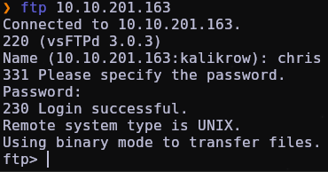
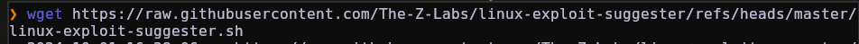

# ./


## AGENT SUDO 

### (Uso de Burpsuite, esteganografía y johntheripper)

Iniciamos la máquina en tryhackme después de haber iniciado la vpn correspondiente.


Hacemos un ping para saber: 1º, si la máquina atacante es Windows y 2º, para saber si tenemos conexión con la víctima.


`aquí la función con la que he hecho el ping`

```bash
# Mostrar el TARGET
function target(){
        lectura=$(cat ~/.config/polybar/shapes/scripts/target | awk '{print $1}')
        ping -c1 $lectura 2>/dev/null

if [ $? -ne 0 ]; then
                echo -e "\e[1;34m Primero tienes que añadir una ip VÁLIDA con el comando 'set>
                return 1
fi
}
```


Hacemos un escaneo con nmap para ver puertos abiertos.


`Dejo aquí la función para automatizar los escaneos`

```bash
# Función de NMAP
function escaneo() {

archivo_target=~/.config/polybar/shapes/scripts/target
archivo_resultado="escaneo_nmap"  # Archivo de salida del escaneo
cancelado=0 # Variable para controlar si se ha cancelado el escaneo

# Configuramos el trap para capturar la señal de interrupción (Ctrl+C) y eliminar el arch>
trap "echo -e '\e[1;31m Escaneo cancelado. Eliminando archivo de resultados... \e[0m'; rm>

# Verificamos si el archivo tiene contenido
if [ $(wc -w < "$archivo_target") -gt 0 ]; then

# Ahora leeremos el archivo para encontrar una IP válida.
busqueda_ip=$(grep -oE '([0-9]{1,3}\.){3}[0-9]{1,3}' "$archivo_target" | head -n 1)

# Comprobamos si se encontró una IP válida
if [ -z "$busqueda_ip" ]; then
echo -e "\e[1;31m No se encontró ninguna IP válida en el archivo. Asegúrate de ag>
return 1  # Salir si no se encontró IP
fi

# Realizamos el escaneo con la IP encontrada
nmap -p- --open -sCV -sS -n -Pn -vvv $busqueda_ip -oN $archivo_resultado 2>/dev/null

# Comprobamos si se ha cancelado el escaneo
if [ $cancelado -eq 1 ]; then
return 1  # Salir si se ha cancelado el escaneo
fi

# Comprobamos si hubo un error en el escaneo
if [ $? -ne 0 ]; then
echo -e "\e[1;31m Hubo un problema al realizar el escaneo, prueba a poner una IP >
rm -f $archivo_resultado  # Eliminar el archivo de resultado del escaneo si falló
return 1  # Salir si el escaneo falló
fi

# Comprobamos si el escaneo encontró algún puerto abierto (o IP activa)
if ! grep -q "open" $archivo_resultado; then
echo -e "\e[1;33m El escaneo no encontró ninguna IP activa o puertos abiertos en >
rm -f $archivo_resultado  # Eliminar el archivo si no hay resultados útiles

return 1  # Salir si no se encontraron puertos abiertos
fi

echo -e "\e[1;32m Escaneo completado exitosamente. \e[0m"

else
# Si el archivo está vacío o no tiene palabras, mostramos un mensaje de error
echo -e "\e[1;34m No has añadido ningún objetivo!! Dime cuál es la IP a la que debo h>
return 1  # Salir si no se encontró contenido en el archivo
fi
}
```


Como vemos están abiertos varios puertos


En este caso vamos a empezar por entrar en el puerto 80 que es una página web


Aquí vemos una posible pista: user-agent. 


Abrimos Burpsuite y cambiamos el Proxy 


Una vez en burpsuite, Activamos la intercepción.


En la web, recargamos la página para que nos detecte el burpsuite.


Y aquí vemos la solicitud de la web.


Localizamos lo que antes nos dió como pista la web


Y vamos probando, ya que el mensaje estaba hecho por un tal "Agent R", yo fui probando con letras. (A,B,C,D,E, etc.). En este caso probamos con la letra "C".


Le damos a "forward" para enviar la solicitud modificada.


Y en la web nos aparece otro mensaje distinto.


Si nos fijamos un poco en el mensaje, nos da otra pista. Nos está dando un usuario (chris) y una posible forma de como conseguir la contraseña.


Como nos dice que la contraseña es muy débil, vamos a probar con un ataque de fuerza bruta, utilizaremos hydra con estos parámetros:

```bash
hydra 10.10.201.163 ftp -l chris -P /usr/share/wordlists/rockyou.txt -T 30 -I -o hydra.txt
```
Abrimos el archivo que nos saca hydra, y vemos la contraseña.


Vamos a intentar entrar en ftp con el usuario y la contraseña que tenemos 



Una vez dentro, miramos los archivos que hay.


Los descargamos todos en nuestra máquina atacante.


Y aquí los tenemos.


Leemos el archivo de texto y nos dice que todas las fotos son "falsas", lo que nos dice que tenemos que hacer un poco de estenografía para sacar los archivos ocultos en las fotos.


Usaremos binwalk en las fotos, para ver si hay algún archivo oculto, en "cutie.png" tenemos un archivo .zip encriptado.


Vamos a utilizar foremost para extraer ese archivo.


Una vez extraído, usaremos la herramienta de "johntheripper", en este caso usaremos primero una de sus versiones, "zip2john", que se usa para extraer los hashes de los archivos.


Ahora que tenemos el hash, usamos otra vez johntheripper para ejecutar un ataque de fuerza bruta sobre ese hash, con el objetivo de conseguir una contraseña, como yo ya lo había hecho, utilizo el parámetro `--show` para que me muestre la contraseña, que en este caso era "alien".


Ahora que tenemos la contraseña, vamos a extraer el archivo .zip para ver que contiene.


Nos extrae una archivo de texto que contiene un mensaje extraño, el cual parece estar codificado en base64.


Lo decodificamos y nos aparece una contraseña, recordemos que nos queda una imagen de las primeras que encontramos en ftp que no la hemos mirado.


En la otra imagen utilizaremos steghide para extraer lo que hay dentro, nos pedirá una frase como contraseña, la cual acabamos de decodificar.


Nos extrae un mensaje que muestra una contraseña y un usuario


Si volvemos a ver el escaneo que hicimos con nmap al principio, vemos que también estaba abierto el puerto de ssh


Intentamos entrar en la máquina víctima con la contraseña y el usuario que tenemos.


Vemos que  somos el usuario "james"


Conseguimos la "user_flag"


A continuación, necesitamos escalar privilegios para ser root, para esto vamos a utilizar "linux exploit suggester", que es un programa muy útil que nos da recomendaciones de por donde seguir en base a las vulnerabilidades que encuentra en el sistema.


Lo descargamos de github




y creamos un servidor http por el puerto 8008 para descargarlo en la máquina víctima.


Volvemos a la máquina víctima y lo descargamos


Le damos al script los privilegios necesarios para ejecutarlo


y lo ejecutamos


Investigando vemos que nos aparece esta vulnerabilidad, tenemos un código CVE el cual buscaremos por internet para encontrar una forma de explotarlo


Una vez encontrado el repositorio de github, lo descargamos primero en nuestra máquina atacante.


Volvemos a hacer el mismo proceso de iniciar el servidor http


y lo descargamos, igual que antes, en la máquina víctima


Le volvemos a dar permisos


Y lo ejecutamos


Ya somos root  :)


