# CLUEDO [By SamuCrow] / Easy
### (Decoding [CyberChef], Fuzzing web, escalada mediante AWK)

#### - - - - - - - - - - - - - - - - - - - - - - - - - - - - - - - - - - - - - - - - - - - - - - - - - - - - - - - - 

###### si quieres descargar la máquina aquí la tienes: https://mega.nz/file/Ai4zXZ5B#sE98B_YIa7rp3KEs0yM-DBzgNizAhu1yk41CB8FordY

En primer lugar, vamos a buscar las ips que hay en nuestra red, para eso utilizaremos arp-scan

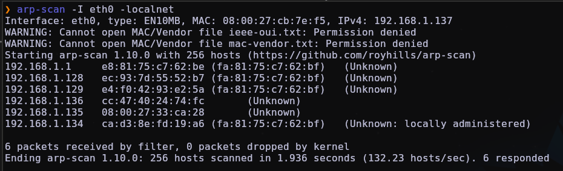

vemos que la MAC empieza por 08:00:, eso quiere decir que es una máquina virtual

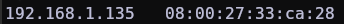

Tiramos un escaneo de nmap para ver puertos abiertos y nos salen estos:

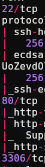

Si hacemos fuzzing de directorios nos aparece 1 que nos llama la atención, previamente si visitamos la web principal nos da un par de pistas también 

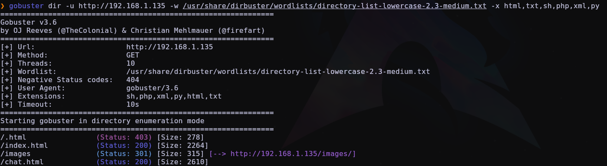

nos metemos en el buscador

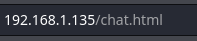

y vemos que hay unas palabras raras, podría ser que está encodeado

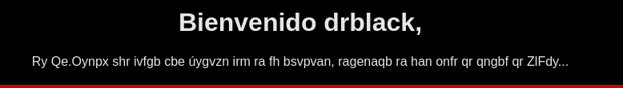

Vamos a Cyberchef, nuestra página de confianza para estas cosas

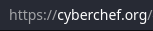

Y ponemos que nos lo decodifique en ROT13, ya que había una pista en la web principal

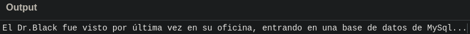

Vemos también que hay un nombre de usuario que, por las pintas, parece que es un directorio, pero podemos intuir que también está encodeado

Si volvemos a Cyberchef y probamos otra vez con ROT13 nos saca un .txt

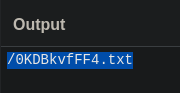

Vamos a probar a ponerlo como subdirectorio

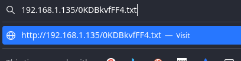

Y nos saca un mensaje en base64

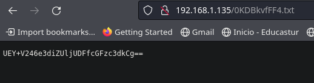

Nos vamos a la terminal y lo desciframos

Nos da una contraseña que nos servirá para entrar mediante mysql

Nos pide un certificado firmado

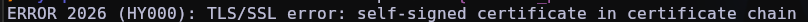

pero hacemos un bypass de eso con este comando

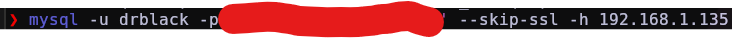

ahora nos metemos en la base de datos y vemos lo que hay

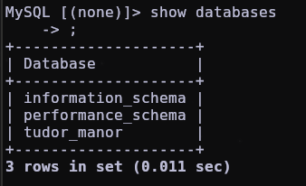

nos metemos en tudor_manor

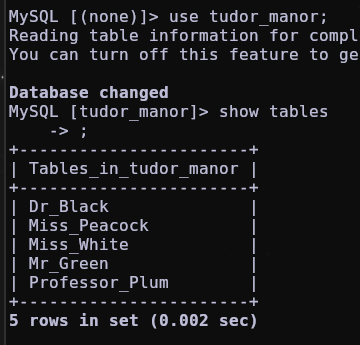

y vamos a dr.black, que es el usuario que hemos visto. Nos da otro subdirectorio

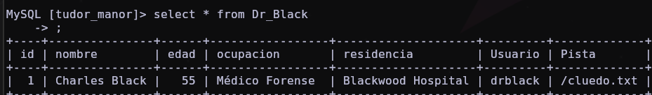

lo buscamos y parece que es un diccionario

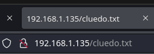

lo descargamos mediante `wget`

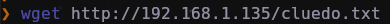

y nos volvemos al directorio de chat.html para buscar más posibles usuarios

Vemos que nos da otro usuario

Vamos a probar a hacer fuerza bruta por ssh

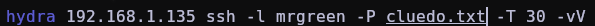

y nos encuentra una contraseña 

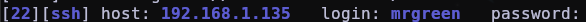

entramos en la máquina victima

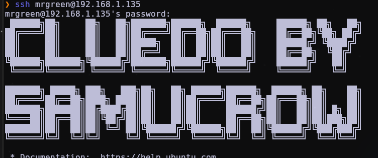

y si leemos el user.txt vemos el siguiente mensaje

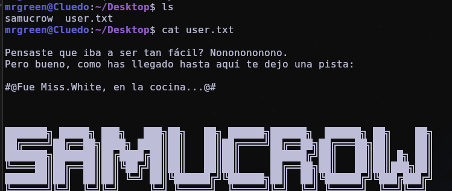

Vamos a seguir los pasos buscando en los directorios de la máquina, pero no tenemos permisos

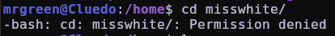

si hacemos un `sudo - l` vemos que tenemos una forma de escalar privilegios

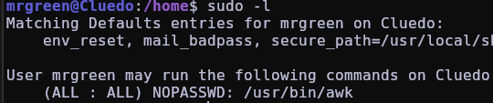

nos metemos en https://gtfobins.github.io para ver que nos propone para awk

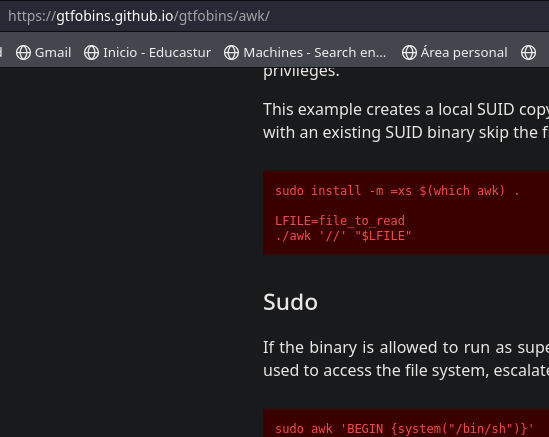

y metemos el comando

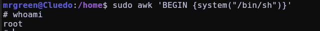

ya somos root, ahora vamos a buscar la flag en los directorios

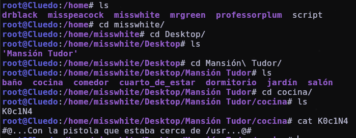

nos vamos a /usr

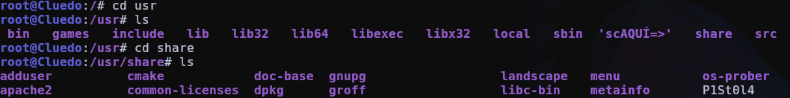

y leemos la pista

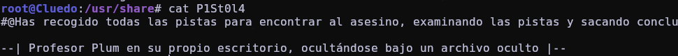

nos vamos al último directorio que nos manda y ya tenemos la flag de root

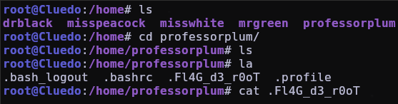

# ./ROOTED
